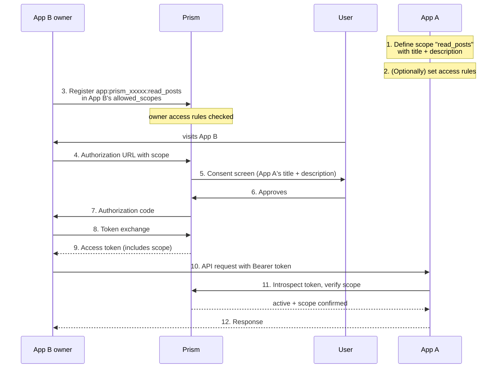

# Cross-App Permissions

Prism supports a delegation model where **App A** can expose named permission scopes,
and **App B** can request those scopes on behalf of a user during the standard OAuth
flow. The user sees a clear consent screen listing exactly what App B is asking for,
using the titles and descriptions that App A has defined.

**Use cases**

- An API platform (App A) lets third-party apps (App B) access specific user data
- A service (App A) exposes fine-grained write permissions that partner apps request
- A team's internal tool (App A) integrates with an org-wide identity provider

The scope format is:

```
app:<App_A_client_id>:<inner_scope>
```

For example: `app:prism_xxxxx:read_posts`

---

## App A — Exposing permission scopes

App A is the _provider_: it defines what scopes exist and controls who can use them.

### 1. Define scope metadata

Open the app in the dashboard, go to the **Permissions** tab, and add scope definitions.
Each definition has:

| Field        | Purpose                                                      |
|--------------|--------------------------------------------------------------|
| Scope ID     | Short identifier, e.g. `read_posts` (alphanumeric, `-`, `_`)|
| Title        | Human-readable name shown on the consent screen              |
| Description  | One-sentence explanation shown below the title               |

Or via API (requires a user token with write access to App A):

```bash
curl -X POST https://your-prism.example/api/apps/<appA_id>/scope-definitions \
  -H "Authorization: Bearer <token>" \
  -H "Content-Type: application/json" \
  -d '{
    "scope": "read_posts",
    "title": "Read posts",
    "description": "View the user'\''s published and draft posts"
  }'
```

#### App-self management (optional)

If you turn on **Let this app manage its own exported permission scope
definitions via client credentials** in App A's settings (the
`allow_self_manage_exported_permissions` flag), App A can call the same
`scope-definitions` endpoints directly with HTTP Basic auth — no user token
required. This lets the app register/update/delete its own exported scopes at
deploy time or from a backend job.

Scope is strictly limited: only App A's own `/scope-definitions` endpoints, and
the authenticated app's id must match the URL. Public clients (PKCE, no
secret) cannot use this mode. Access-rule management
(`/scope-access-rules`) still requires a user token.

```bash
curl -X POST https://your-prism.example/api/apps/<appA_id>/scope-definitions \
  -u '<appA_client_id>:<appA_client_secret>' \
  -H "Content-Type: application/json" \
  -d '{
    "scope": "read_posts",
    "title": "Read posts",
    "description": "View the user'\''s published and draft posts"
  }'
```

Or via `@siiway/prism`:

```ts
const prism = new PrismClient({
  baseUrl: "https://your-prism.example",
  clientId: appA_client_id,
  clientSecret: appA_client_secret,
  redirectUri: "...",
});

await prism.appScopePermissions.upsertDefinitionAsSelf(appA_id, {
  scope: "read_posts",
  title: "Read posts",
  description: "View the user's published and draft posts",
});
```

### 2. Set access rules (optional)

By default any app owner can register your scopes and any app can request them.
Use access rules to restrict this.

#### Owner rules — who can add your scopes to their `allowed_scopes`

| Rule type      | Effect                                                          |
|----------------|-----------------------------------------------------------------|
| `owner_allow`  | Allowlist: only these user IDs may register your scopes         |
| `owner_deny`   | Denylist: these user IDs may never register your scopes         |

If any `owner_allow` rule exists, it becomes an allowlist (all others are denied).

#### App rules — which apps can request your scopes at OAuth time

| Rule type   | Effect                                                             |
|-------------|--------------------------------------------------------------------|
| `app_allow` | Allowlist: only these `client_id`s may request your scopes         |
| `app_deny`  | Denylist: these `client_id`s may never request your scopes         |

```bash
# Allow only a specific partner app to request your scopes at OAuth time
curl -X POST https://your-prism.example/api/apps/<appA_id>/scope-access-rules \
  -H "Authorization: Bearer <token>" \
  -H "Content-Type: application/json" \
  -d '{ "rule_type": "app_allow", "target_id": "prism_partnerapp_clientid" }'
```

### 3. Verify incoming tokens on your API

When App B makes a request to App A's API, it passes the user's access token.
App A **must** verify the token using Prism's introspection endpoint and check that:

1. The token is active
2. The scopes include `app:<App_A_client_id>:<inner_scope>`
3. The `client_id` in the response matches App B (optional, for extra lockdown)

```bash
POST /api/oauth/introspect
Content-Type: application/x-www-form-urlencoded

token=<access_token>
```

Response:

```json
{
  "active": true,
  "scope": "openid profile app:prism_xxxxx:read_posts",
  "client_id": "prism_appB_clientid",
  "sub": "usr_abc123",
  "exp": 1741568400
}
```

Node.js example:

```ts
async function requireAppScope(
  accessToken: string,
  prismBase: string,
  requiredScope: string,           // e.g. "app:prism_xxxxx:read_posts"
  expectedClientId?: string,       // optional: only accept tokens from App B
): Promise<{ userId: string; clientId: string }> {
  const res = await fetch(`${prismBase}/api/oauth/introspect`, {
    method: "POST",
    headers: { "Content-Type": "application/x-www-form-urlencoded" },
    body: new URLSearchParams({ token: accessToken }),
  });
  const data = await res.json() as {
    active: boolean;
    scope?: string;
    client_id?: string;
    sub?: string;
  };

  if (!data.active) throw new Error("Token inactive");

  const scopes = (data.scope ?? "").split(" ");
  if (!scopes.includes(requiredScope))
    throw new Error(`Missing required scope: ${requiredScope}`);

  if (expectedClientId && data.client_id !== expectedClientId)
    throw new Error("Token was not issued to the expected app");

  return { userId: data.sub!, clientId: data.client_id! };
}
```

---

## App B — Requesting another app's scopes

App B is the _consumer_: it requests App A's permission scopes during OAuth.

### 1. Add the scope to `allowed_scopes`

In the App B dashboard → Settings, under **App Permissions**, enter App A's
`client_id` and select the inner scope, then click **Add**. This registers
`app:<App_A_client_id>:<inner_scope>` in App B's `allowed_scopes`.

Or via API:

```bash
curl -X PATCH https://your-prism.example/api/apps/<appB_id> \
  -H "Authorization: Bearer <token>" \
  -H "Content-Type: application/json" \
  -d '{
    "allowed_scopes": [
      "openid", "profile", "email",
      "app:prism_xxxxx:read_posts"
    ]
  }'
```

> This step is gated by App A's owner access rules. If App A has set an
> `owner_allow` list and your user ID is not on it, the request will be rejected.

### 2. Request the scope in the authorization URL

Include the scope string in the `scope` parameter:

```
https://your-prism.example/api/oauth/authorize
  ?client_id=<appB_client_id>
  &redirect_uri=https://appb.example/callback
  &response_type=code
  &scope=openid+profile+app%3Aprism_xxxxx%3Aread_posts
  &code_challenge=...
  &code_challenge_method=S256
```

### 3. Consent screen

The user will see a consent card for the cross-app scope, using App A's custom
title and description:

```
✓ Read posts                           ← App A's title
  View the user's published and draft  ← App A's description
  posts · App A · read_posts
```

If no scope definition exists, the consent screen falls back to a generic
description.

### 4. Exchange the code and use the token

After the user approves, exchange the authorization code for an access token
exactly as in a standard OAuth flow. The resulting token's `scope` field will
include `app:prism_xxxxx:read_posts`.

Pass that token as a `Bearer` when calling App A's API:

```ts
const res = await fetch("https://appa.example/api/posts", {
  headers: { Authorization: `Bearer ${accessToken}` },
});
```

App A's server introspects the token (step 3 of App A's guide above) and
serves the response if the scope is present.

---

## Full flow diagram



---

## Security notes

- App A's `client_secret` is not involved in this flow — only the `client_id`
  identifies App A's scope namespace.
- App A should always verify tokens via introspection, not by trusting the
  token payload directly.
- If you want to restrict which apps can use your scopes, set `app_allow` rules
  **before** publishing your `client_id` to potential integrators.
- Revoking a user's token for App B (via the consent revocation UI) also removes
  their access to App A's resources — no extra action needed.
