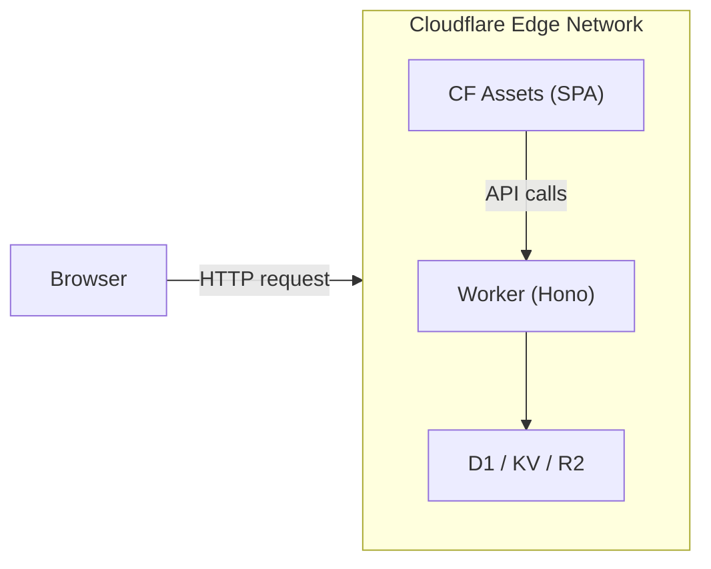
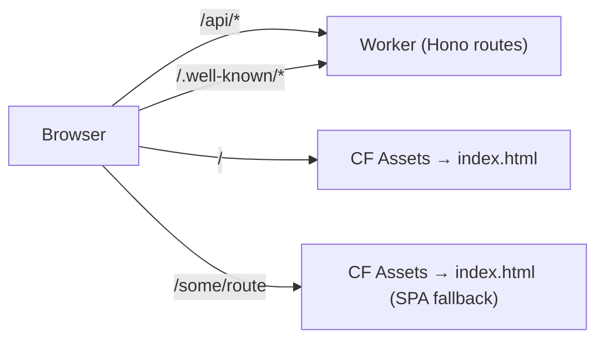
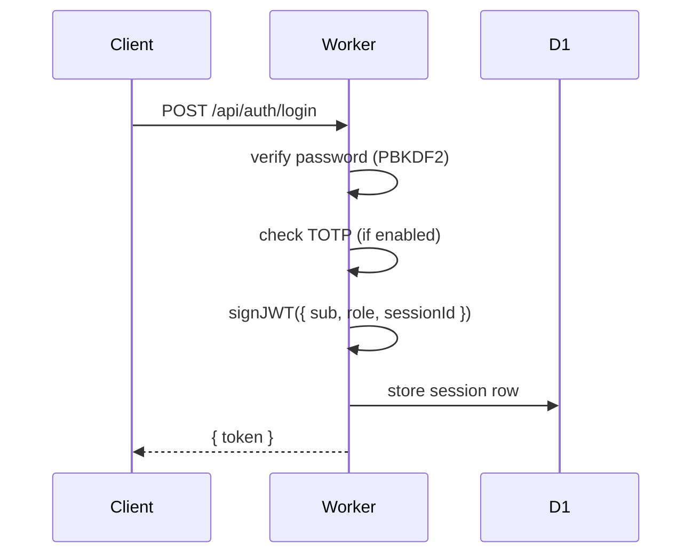
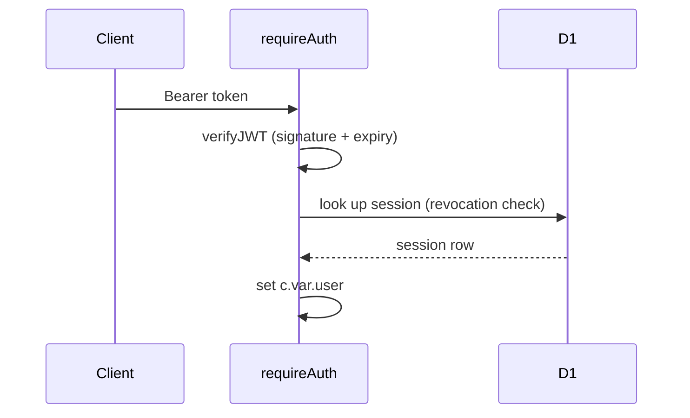

# Architecture

## Overview

Prism is a monorepo with two main parts:

- **Backend** (`worker/`) — a Cloudflare Worker written in TypeScript with [Hono](https://hono.dev)
- **Frontend** (`src/`) — a React SPA built with Vite and served from Cloudflare Assets



A single `wrangler deploy` publishes both the Worker and the built frontend assets.
Cloudflare's asset serving handles SPA fallback (all unknown paths serve `index.html`).

## Request flow



Vite proxies `/api/*` to `http://localhost:8787` in development, so the same
codebase works locally and in production without any URL changes.

## Worker structure

```text
worker/
├── index.ts              # App entry; CORS, secureHeaders, route mounting
├── types.ts              # D1 row types, Variables, SiteConfig
│
├── db/migrations/
│   └── 0001_init.sql     # Full schema + default site_config rows
│
├── lib/
│   ├── config.ts         # getConfig(), setConfigValues() — D1-backed key/value store
│   ├── crypto.ts         # randomId, hashPassword/verifyPassword (PBKDF2), verifyPoW
│   ├── email.ts          # sendEmail() — Resend / Mailchannels adapters
│   ├── jwt.ts            # signJWT / verifyJWT — HS256 via Web Crypto
│   ├── totp.ts           # TOTP / HOTP (RFC 6238), backup codes
│   └── webauthn.ts       # Passkey registration/authentication via @simplewebauthn/server
│
├── middleware/
│   ├── auth.ts           # requireAuth, requireAdmin, optionalAuth
│   ├── captcha.ts        # verifyCaptchaToken() — dispatches to provider
│   └── rateLimit.ts      # KV sliding-window rate limiter
│
└── routes/
    ├── init.ts           # First-run setup
    ├── auth.ts           # Register, login, TOTP, passkeys, sessions
    ├── oauth.ts          # Authorization server, token endpoint, OIDC
    ├── apps.ts           # OAuth app CRUD
    ├── domains.ts        # Domain verification
    ├── connections.ts    # Social OAuth flows
    ├── user.ts           # Profile, avatar, password, delete account
    └── admin.ts          # Admin: config, users, apps, audit log
```

## Data model

### `users`

Core identity record. `password_hash` is nullable (accounts created via social login
have no password). `role` is `user` or `admin`.

### `sessions`

Stores a SHA-256 hash of the JWT's `sessionId` claim. On logout or admin revocation,
the row is deleted — the JWT becomes invalid even though it hasn't expired, because
the middleware checks session existence in KV/D1.

> Currently sessions are validated by KV lookup on each request. Session rows are
> also in D1 for admin visibility.

### `totp_secrets`

One row per user. `enabled = 0` while setup is in progress (not yet verified).
`backup_codes` is a JSON array of bcrypt-hashed codes.

### `passkeys`

WebAuthn credentials. `credential_id` is base64url-encoded. The `counter` field
is updated on every successful authentication for clone detection.

### `oauth_apps`

Apps registered by users. `client_secret` is stored in plaintext (required for
`client_secret_basic`/`client_secret_post` auth). `is_verified` is set by admins.

### `oauth_codes`

Short-lived (10 min) authorization codes. Deleted after exchange.

### `oauth_tokens`

Access and refresh tokens. `access_token` is a random opaque string. The actual
JWT issued to clients embeds the `access_token` as the payload for direct validation
without DB lookup.

### `oauth_consents`

Records which scopes a user has already approved for a given client. Used to skip
the consent screen on repeat authorizations.

### `domains`

Domains added by users for OAuth redirect URI validation. Verified via DNS TXT
record at `_prism-verify.<domain>`. `next_reverify_at` is set based on the
`domain_reverify_days` config.

### `social_connections`

Linked social provider accounts. `(user_id, provider)` is unique — one account per
provider per user. `(provider, provider_user_id)` is also unique, preventing the
same social account from being linked to multiple Prism accounts.

### `site_config`

Flat key/value store for all runtime configuration. Values are JSON-encoded strings
so booleans and numbers round-trip correctly.

### `audit_log`

Append-only log of significant actions (login, registration, config changes, etc.).

## Authentication flow



On each authenticated request:



## PoW (Proof of Work)

The PoW system is an alternative to third-party captcha services.

1. `GET /api/auth/pow-challenge` — server generates a random 32-byte challenge, stores it in KV (10 min TTL), returns `{ challenge, difficulty }`
2. Client calls `solvePoW(challenge, difficulty)` in a Web Worker — tries nonces until `SHA-256(challenge + nonce_be32)` has `difficulty` leading zero bits
3. Client submits `{ pow_challenge, pow_nonce }` with the registration/login request
4. Server calls `verifyPoW()` and checks the KV store for the challenge (deletes it after use to prevent replay)

The WASM module (`public/pow.wasm`) compiled from `pow/src/lib.rs` accelerates solving ~10×. The pure-JS fallback (`src/lib/pow.ts`) handles cases where WASM is unavailable.

## Security notes

- All cryptography uses the **Web Crypto API** — no Node.js `crypto` module
- Passwords are hashed with **PBKDF2** (100,000 iterations, SHA-256, 16-byte random salt)
- JWTs are signed with **HMAC-SHA256**
- TOTP uses **HMAC-SHA1** per RFC 6238, with a ±1 step window
- PKCE uses **S256** (plain is also accepted for backward compatibility)
- Rate limiting uses a KV-backed sliding window
- The session `sessionId` is stored as a hash — a compromised DB cannot derive valid tokens
