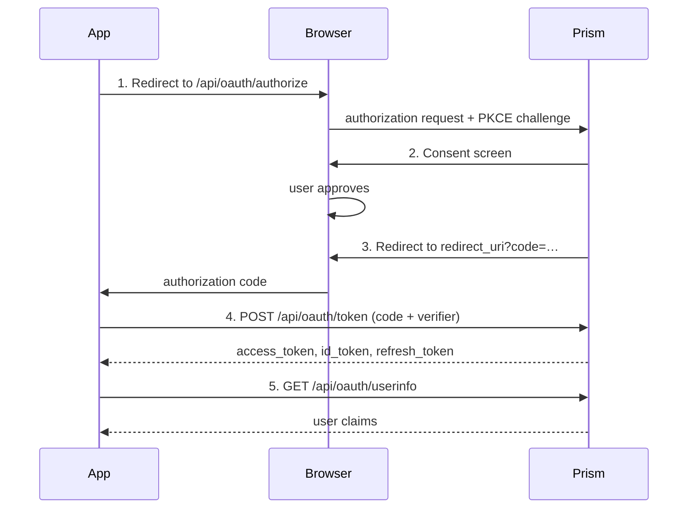

Prism is a standards-compliant OAuth 2.0 authorization server and OpenID Connect provider. Any application that supports OAuth 2.0 authorization code flow can use Prism as its identity provider.

## Discovery

The OpenID Connect discovery document is available at:

```text
https://your-prism-domain/.well-known/openid-configuration
```

Most OAuth/OIDC libraries can auto-configure from this URL.

## Registering an application

1. Log in to Prism and go to **Apps → New Application**
2. Fill in the name, description, and redirect URIs
3. Copy the **Client ID** and **Client Secret** — the secret is shown only once

If your app runs entirely in the browser (no server to keep the secret), enable
**Public client**. Public clients must use PKCE and do not have a client secret.

## Authorization code flow (with PKCE)



### Step 1 — Redirect the user

```text
GET https://your-prism-domain/api/oauth/authorize
  ?response_type=code
  &client_id=<CLIENT_ID>
  &redirect_uri=https://yourapp.com/callback
  &scope=openid profile email
  &state=<RANDOM_STATE>
  &code_challenge=<CODE_CHALLENGE>
  &code_challenge_method=S256
```

**PKCE** — generate a `code_verifier` (43–128 random URL-safe characters), then:

```text
code_challenge = BASE64URL(SHA-256(ASCII(code_verifier)))
```

#### Scopes

| Scope                   | Claims / access granted                                |
|-------------------------|--------------------------------------------------------|
| `openid`                | `sub`, `iss`, `aud`, `iat`, `exp` (required for OIDC)  |
| `profile`               | `name`, `preferred_username`, `picture`                |
| `profile:write`         | Update the user's profile (name, picture)              |
| `email`                 | `email`, `email_verified`                              |
| `apps:read`             | List of apps the user owns                             |
| `apps:write`            | Create, update, and delete the user's apps             |
| `teams:read`            | List the user's teams                                  |
| `teams:write`           | Update team settings and manage members                |
| `teams:create`          | Create new teams                                       |
| `teams:delete`          | Delete teams                                           |
| `domains:read`          | List the user's custom domains                         |
| `domains:write`         | Add and remove custom domains                          |
| `gpg:read`              | List the user's registered GPG public keys             |
| `gpg:write`             | Add and remove GPG public keys                         |
| `social:read`           | List the user's linked social provider accounts        |
| `social:write`          | Disconnect social provider accounts                    |
| `webhooks:read`         | List the user's webhooks                               |
| `webhooks:write`        | Create, update, and delete webhooks                    |
| `admin:users:read`      | Read all user accounts (admin only)                    |
| `admin:users:write`     | Modify user accounts (admin only)                      |
| `admin:users:delete`    | Delete user accounts (admin only)                      |
| `admin:config:read`     | Read instance configuration (admin only)               |
| `admin:config:write`    | Update instance configuration (admin only)             |
| `admin:invites:read`    | List invitations (admin only)                          |
| `admin:invites:create`  | Create invitations (admin only)                        |
| `admin:invites:delete`  | Delete invitations (admin only)                        |
| `admin:webhooks:read`   | List instance-level webhooks (admin only)              |
| `admin:webhooks:write`  | Create and update instance-level webhooks (admin only) |
| `admin:webhooks:delete` | Delete instance-level webhooks (admin only)            |
| `offline_access`        | Enables refresh token issuance                         |

### Step 2 — User consents

Prism shows a consent screen listing your app name and the requested scopes.
If the user has already consented to the same scopes, the consent screen is
skipped automatically.

### Step 3 — Receive the code

Prism redirects to your `redirect_uri`:

```text
https://yourapp.com/callback?code=<AUTH_CODE>&state=<STATE>
```

Always verify that `state` matches what you sent.

### Step 4 — Exchange for tokens

```http
POST /api/oauth/token
Content-Type: application/x-www-form-urlencoded

grant_type=authorization_code
&code=<AUTH_CODE>
&redirect_uri=https://yourapp.com/callback
&client_id=<CLIENT_ID>
&client_secret=<CLIENT_SECRET>
&code_verifier=<CODE_VERIFIER>
```

Public clients omit `client_secret` and must include `code_verifier`.

#### Response

```json
{
  "access_token": "...",
  "token_type": "Bearer",
  "expires_in": 3600,
  "refresh_token": "...",
  "id_token": "...",
  "scope": "openid profile email"
}
```

### Step 5 — Call UserInfo

```http
GET /api/oauth/userinfo
Authorization: Bearer <ACCESS_TOKEN>
```

#### UserInfo response

```json
{
  "sub": "user-id",
  "name": "Alice",
  "preferred_username": "alice",
  "email": "alice@example.com",
  "email_verified": true,
  "picture": "https://your-prism-domain/api/assets/avatars/..."
}
```

## Refreshing tokens

```http
POST /api/oauth/token
Content-Type: application/x-www-form-urlencoded

grant_type=refresh_token
&refresh_token=<REFRESH_TOKEN>
&client_id=<CLIENT_ID>
&client_secret=<CLIENT_SECRET>
```

## Token introspection (RFC 7662)

For server-to-server verification without parsing JWTs:

```http
POST /api/oauth/introspect
Content-Type: application/x-www-form-urlencoded
Authorization: Basic <base64(client_id:client_secret)>

token=<ACCESS_TOKEN>
```

### Response (active token)

```json
{
  "active": true,
  "sub": "user-id",
  "scope": "openid profile",
  "client_id": "...",
  "exp": 1234567890,
  "iat": 1234564290
}
```

## Token revocation (RFC 7009)

```http
POST /api/oauth/revoke
Content-Type: application/x-www-form-urlencoded

token=<ACCESS_OR_REFRESH_TOKEN>
&client_id=<CLIENT_ID>
&client_secret=<CLIENT_SECRET>
```

## ID token

The ID token is a signed JWT (RS256). Verify it using the public key published at `/.well-known/jwks.json`, or use the introspection endpoint for server-side validation without parsing JWTs.

Standard claims (always present when `openid` scope is requested):

| Claim   | Value                             |
|---------|-----------------------------------|
| `iss`   | Your Prism instance URL           |
| `sub`   | Stable user ID                    |
| `aud`   | Your `client_id`                  |
| `iat`   | Issued-at timestamp               |
| `exp`   | Expiry timestamp                  |
| `role`  | User role (`user` or `admin`)     |
| `nonce` | Echoed from authorization request |

Scope-gated claims — `profile` and `email` claims are included whenever the corresponding scope is granted. The remaining claims below also require the application to declare the field name in its `oidc_fields` configuration:

| Scope | Field name | Claim(s) added to ID token |
| --- | --- | --- |
| `profile` | _(always)_ | `name`, `preferred_username`, `picture` |
| `email` | _(always)_ | `email`, `email_verified` |
| `teams:read` | `teams` | `teams` — array of `{ id, name, role }` objects for the user's team memberships |
| `apps:read` | `apps` | `apps` — array of `{ id, name, client_id, is_verified }` objects for the user's apps |
| `domains:read` | `domains` | `domains` — array of `{ id, domain, verified }` objects |
| `gpg:read` | `gpg_keys` | `gpg_keys` — array of `{ id, fingerprint, key_id, name }` objects |
| `social:read` | `social_accounts` | `social_accounts` — array of `{ id, provider, provider_user_id }` objects |

To opt an application into a custom claim, include the field name in the app's `oidc_fields` array when creating or updating it via the API:

```json
{ "oidc_fields": ["teams", "domains"] }
```

## Step-up 2FA

Apps can ask Prism to have the user re-confirm with TOTP or passkey before performing a sensitive action — wire transfers, deleting resources, granting elevated access, etc. The flow mirrors the Authorization Code grant: redirect the user, get a single-use code back, exchange it server-side.

The user must be logged into Prism (they're redirected to login if not) and have a TOTP authenticator or passkey enrolled. No new account access is granted — the result is a one-time proof that the user re-confirmed.

### Step 1 — Redirect the user

```text
GET https://prism.example.com/api/oauth/2fa
  ?client_id=YOUR_CLIENT_ID
  &redirect_uri=https://app.example.com/2fa-callback
  &state=RANDOM
  &action=Confirm+wire+transfer+of+%241%2C000
  &nonce=order_abc123
  &code_challenge=PKCE_CHALLENGE
  &code_challenge_method=S256
```

| Parameter | Required | Description |
| --- | --- | --- |
| `client_id` | yes | Your OAuth app's client ID |
| `redirect_uri` | yes | Must be registered on the OAuth app |
| `state` | recommended | Echoed back; verify on callback (CSRF defense) |
| `action` | recommended | Human-readable description of what the user is confirming. Shown verbatim on the Prism page and echoed in the verify response |
| `nonce` | optional | App-defined opaque value, echoed back. Bind it to the operation (e.g. an order ID) |
| `code_challenge`, `code_challenge_method` | required for public clients | PKCE — see Authorization Code flow |

### Step 2 — User confirms

Prism shows the app icon, the `action` text, and prompts for TOTP or passkey. The user clicks **Confirm** or **Deny**.

### Step 3 — Receive the code

Prism redirects the user back to your `redirect_uri`:

```text
https://app.example.com/2fa-callback?code=…&state=…
```

Or, on denial / error:

```text
https://app.example.com/2fa-callback?error=access_denied&state=…
```

### Step 4 — Verify (server-side)

```http
POST /api/oauth/2fa/verify
Content-Type: application/x-www-form-urlencoded

code=THE_CODE&client_id=YOUR_CLIENT_ID&code_verifier=PKCE_VERIFIER
```

Confidential clients send `client_secret` in the body or via HTTP Basic. Public clients use PKCE only.

#### Response

```json
{
  "user_id": "u_abc",
  "client_id": "YOUR_CLIENT_ID",
  "verified_at": 1761500000,
  "action": "Confirm wire transfer of $1,000",
  "nonce": "order_abc123",
  "method": "totp"
}
```

The code is single-use and expires 5 minutes after issuance. After successful verification:

- `verified_at` is the unix timestamp the user completed 2FA — treat anything older than your acceptable window as stale.
- Compare `nonce` and `action` against what your app stored when it built the URL — if they don't match, reject the result.
- `method` is `"totp"`, `"passkey"`, or `"backup"`.

## Error responses

Authorization errors redirect to your `redirect_uri` with:

```text
?error=access_denied&error_description=User+denied+access
```

Token endpoint errors return HTTP 400:

```json
{ "error": "invalid_grant", "error_description": "Code expired or invalid" }
```

Common error codes: `invalid_request`, `invalid_client`, `invalid_grant`,
`unauthorized_client`, `unsupported_grant_type`, `access_denied`.

## Integrations

### Cloudflare Access

You can use Prism as a generic OIDC identity provider for [Cloudflare Access](https://developers.cloudflare.com/cloudflare-one/identity/idp-integration/generic-oidc/), allowing users to authenticate to Cloudflare-protected resources with their Prism account.

#### Step 1 — Create an OAuth app in Prism

1. Log in to Prism and go to **Apps → New Application**
2. Set the redirect URI to:

   ```text
   https://<your-team-name>.cloudflareaccess.com/cdn-cgi/access/callback
   ```

3. Set **Allowed scopes** to include at minimum `openid` and `email`. Add `profile`, `teams:read`, etc. if you need those claims in Access policies.
4. Set **OIDC fields** to the custom claims you want embedded in the ID token, e.g. `["role", "teams"]`. This controls which scope-gated claims Prism includes.
5. Copy the **Client ID** and **Client Secret**.

#### Step 2 — Add Prism as an identity provider in Cloudflare

In [Cloudflare Zero Trust](https://one.dash.cloudflare.com/), go to **Integrations → Identity providers → Add new → OpenID Connect** and fill in:

| Field | Value |
| --- | --- |
| Name | Prism (or any label) |
| App ID | Your Prism **Client ID** |
| Client secret | Your Prism **Client Secret** |
| Auth URL | `https://your-prism-domain/api/oauth/authorize` |
| Token URL | `https://your-prism-domain/api/oauth/token` |
| Certificate URL | `https://your-prism-domain/.well-known/jwks.json` |
| PKCE | Enabled (recommended) |
| Scopes | `openid email` (add `profile teams:read` etc. as needed) |
| OIDC Claims | One per line — the claim names you want usable in policies |

Under **OIDC Claims**, enter the names of the custom claims Prism returns, for example:

```text
role
in_team_<team-id>
role_in_team_<team-id>
```

After saving, use **Test** to verify. A successful test shows the claims under `oidc_fields`:

```json
{
  "email": "alice@example.com",
  "oidc_fields": {
    "role": "admin",
    "in_team_abc123": true,
    "role_in_team_abc123": "owner"
  }
}
```

#### Step 3 — Build Access policies using Prism claims

In your Access application policy, use the **OIDC Claim** selector:

| Selector | Claim name | Claim value | Effect |
| --- | --- | --- | --- |
| OIDC Claim | `role` | `admin` | Prism admins only |
| OIDC Claim | `in_team_<team-id>` | `true` | Members of a specific team |
| OIDC Claim | `role_in_team_<team-id>` | `owner` | Team owners only |

> **Note:** Cloudflare Access reads custom claims from the **ID token** (RS256-signed JWT). The claim names listed under OIDC Claims in the dashboard must exactly match what Prism embeds in the token, which is controlled by the app's `oidc_fields` setting.
