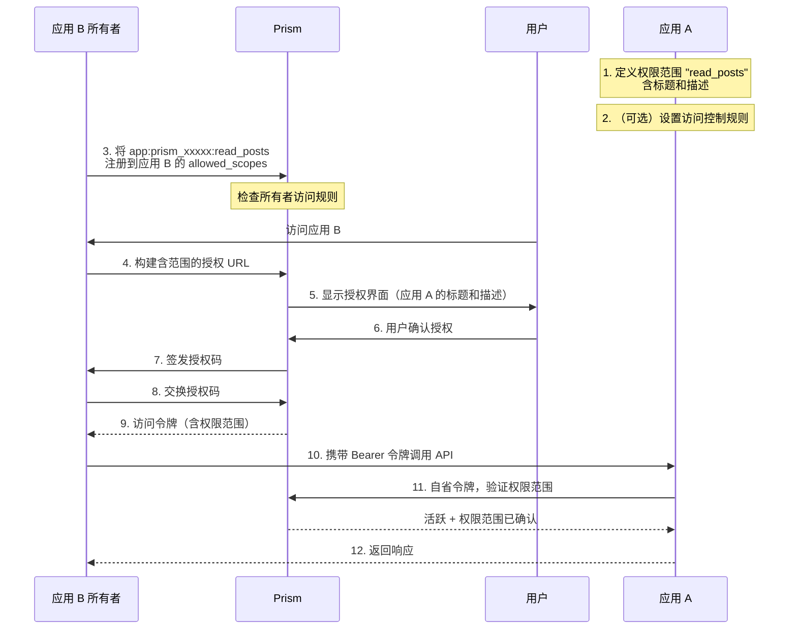

# 跨应用权限

Prism 支持一种委托模型：**应用 A** 可以暴露自定义的权限范围，**应用 B** 则可以在标准 OAuth 流程中代表用户请求这些范围。用户会看到清晰的授权界面，其中列出了应用 B 所请求的内容，标题和描述均由应用 A 自行定义。

**典型场景**

- API 平台（应用 A）允许第三方应用（应用 B）访问特定的用户数据
- 某服务（应用 A）向合作应用暴露细粒度的写权限
- 团队内部工具（应用 A）与组织级身份提供商集成

权限范围的格式为：

```
app:<应用A的client_id>:<内部范围>
```

例如：`app:prism_xxxxx:read_posts`

---

## 应用 A — 暴露权限范围

应用 A 是 _提供方_：它定义权限范围并控制谁可以使用它们。

### 1. 定义权限范围元数据

在仪表盘中打开应用，进入 **权限** 标签页，添加权限范围定义。每条定义包含：

| 字段       | 说明                                                             |
|------------|------------------------------------------------------------------|
| 范围标识符  | 简短标识符，例如 `read_posts`（字母、数字、`-`、`_`）            |
| 标题        | 在授权界面显示的可读名称                                         |
| 描述        | 在标题下方显示的一句话说明                                       |

或通过 API（需要具有应用 A 写权限的用户令牌）：

```bash
curl -X POST https://your-prism.example/api/apps/<appA_id>/scope-definitions \
  -H "Authorization: Bearer <token>" \
  -H "Content-Type: application/json" \
  -d '{
    "scope": "read_posts",
    "title": "读取文章",
    "description": "查看用户已发布和草稿状态的文章"
  }'
```

#### 应用自管理（可选）

若在应用 A 的设置中开启 **允许此应用使用自身客户端凭据管理其导出的权限范围定义**
（`allow_self_manage_exported_permissions` 标志），应用 A 便可直接使用 HTTP
Basic 认证调用 `scope-definitions` 端点，无需用户令牌。适用于部署时或后端
任务中自行注册/更新/删除其导出的权限范围。

作用域被严格限定：仅限应用 A 自己的 `/scope-definitions` 端点，且认证身份
必须与 URL 中的应用 ID 一致。公开客户端（PKCE，无密钥）无法使用此模式。
访问控制规则端点（`/scope-access-rules`）仍需用户令牌。

```bash
curl -X POST https://your-prism.example/api/apps/<appA_id>/scope-definitions \
  -u '<appA_client_id>:<appA_client_secret>' \
  -H "Content-Type: application/json" \
  -d '{
    "scope": "read_posts",
    "title": "读取文章",
    "description": "查看用户已发布和草稿状态的文章"
  }'
```

或通过 `@siiway/prism`：

```ts
const prism = new PrismClient({
  baseUrl: "https://your-prism.example",
  clientId: appA_client_id,
  clientSecret: appA_client_secret,
  redirectUri: "...",
});

await prism.appScopePermissions.upsertDefinitionAsSelf(appA_id, {
  scope: "read_posts",
  title: "读取文章",
  description: "查看用户已发布和草稿状态的文章",
});
```

### 2. 设置访问控制规则（可选）

默认情况下，任何应用所有者都可以注册您的权限范围，任何应用都可以在 OAuth 流程中请求它们。可通过访问规则来限制这一行为。

#### 所有者规则——谁可以将您的范围加入其 `allowed_scopes`

| 规则类型        | 效果                                                   |
|-----------------|--------------------------------------------------------|
| `owner_allow`   | 白名单：仅这些用户 ID 可以注册您的权限范围             |
| `owner_deny`    | 黑名单：这些用户 ID 永远不能注册您的权限范围           |

存在任意 `owner_allow` 规则时，列表切换为白名单模式（未列出的用户均被拒绝）。

#### 应用规则——哪些应用可以在 OAuth 时请求您的范围

| 规则类型    | 效果                                                        |
|-------------|-------------------------------------------------------------|
| `app_allow` | 白名单：仅这些 `client_id` 可以请求您的权限范围             |
| `app_deny`  | 黑名单：这些 `client_id` 永远不能请求您的权限范围           |

```bash
# 仅允许特定合作应用在 OAuth 时请求您的权限范围
curl -X POST https://your-prism.example/api/apps/<appA_id>/scope-access-rules \
  -H "Authorization: Bearer <token>" \
  -H "Content-Type: application/json" \
  -d '{ "rule_type": "app_allow", "target_id": "prism_partnerapp_clientid" }'
```

### 3. 在您的 API 中验证传入令牌

当应用 B 调用应用 A 的 API 时，会携带用户的访问令牌。应用 A **必须**通过 Prism 的令牌自省端点验证该令牌，并检查：

1. 令牌处于活跃状态
2. 权限范围包含 `app:<应用A的client_id>:<内部范围>`
3. 响应中的 `client_id` 与应用 B 匹配（可选，用于更严格的权限控制）

```bash
POST /api/oauth/introspect
Content-Type: application/x-www-form-urlencoded

token=<access_token>
```

响应：

```json
{
  "active": true,
  "scope": "openid profile app:prism_xxxxx:read_posts",
  "client_id": "prism_appB_clientid",
  "sub": "usr_abc123",
  "exp": 1741568400
}
```

Node.js 示例：

```ts
async function requireAppScope(
  accessToken: string,
  prismBase: string,
  requiredScope: string,           // 例如 "app:prism_xxxxx:read_posts"
  expectedClientId?: string,       // 可选：只接受来自应用 B 的令牌
): Promise<{ userId: string; clientId: string }> {
  const res = await fetch(`${prismBase}/api/oauth/introspect`, {
    method: "POST",
    headers: { "Content-Type": "application/x-www-form-urlencoded" },
    body: new URLSearchParams({ token: accessToken }),
  });
  const data = await res.json() as {
    active: boolean;
    scope?: string;
    client_id?: string;
    sub?: string;
  };

  if (!data.active) throw new Error("令牌无效");

  const scopes = (data.scope ?? "").split(" ");
  if (!scopes.includes(requiredScope))
    throw new Error(`缺少必要的权限范围：${requiredScope}`);

  if (expectedClientId && data.client_id !== expectedClientId)
    throw new Error("令牌不是由预期的应用签发的");

  return { userId: data.sub!, clientId: data.client_id! };
}
```

---

## 应用 B — 请求其他应用的权限范围

应用 B 是 _消费方_：它在 OAuth 流程中请求应用 A 的权限范围。

### 1. 将范围加入 `allowed_scopes`

在应用 B 的仪表盘 → 设置中，在 **应用权限** 区域输入应用 A 的 `client_id` 并选择内部范围，然后点击 **添加**。这会将 `app:<应用A的client_id>:<内部范围>` 注册到应用 B 的 `allowed_scopes` 中。

或通过 API：

```bash
curl -X PATCH https://your-prism.example/api/apps/<appB_id> \
  -H "Authorization: Bearer <token>" \
  -H "Content-Type: application/json" \
  -d '{
    "allowed_scopes": [
      "openid", "profile", "email",
      "app:prism_xxxxx:read_posts"
    ]
  }'
```

> 此步骤受应用 A 的所有者访问规则约束。如果应用 A 设置了 `owner_allow` 白名单，而您的用户 ID 不在其中，请求将被拒绝。

### 2. 在授权 URL 中请求该范围

在 `scope` 参数中包含范围字符串：

```
https://your-prism.example/api/oauth/authorize
  ?client_id=<appB_client_id>
  &redirect_uri=https://appb.example/callback
  &response_type=code
  &scope=openid+profile+app%3Aprism_xxxxx%3Aread_posts
  &code_challenge=...
  &code_challenge_method=S256
```

### 3. 授权界面

用户将看到跨应用权限范围的授权卡片，显示应用 A 自定义的标题和描述：

```
✓ 读取文章                                ← 应用 A 的标题
  查看用户已发布和草稿状态的文章           ← 应用 A 的描述
  · 应用 A · read_posts
```

如果未定义权限范围元数据，授权界面将回退到通用描述。

### 4. 交换授权码并使用令牌

用户授权后，按照标准 OAuth 流程交换授权码获取访问令牌。返回令牌的 `scope` 字段中将包含 `app:prism_xxxxx:read_posts`。

调用应用 A 的 API 时，将该令牌作为 `Bearer` 传递：

```ts
const res = await fetch("https://appa.example/api/posts", {
  headers: { Authorization: `Bearer ${accessToken}` },
});
```

应用 A 的服务端对令牌进行自省（参见应用 A 指南的第 3 步），确认权限范围后返回响应。

---

## 完整流程图



---

## 安全说明

- 应用 A 的 `client_secret` 不参与此流程——仅 `client_id` 用于标识应用 A 的权限范围命名空间。
- 应用 A 应始终通过令牌自省来验证令牌，而非直接信任令牌内容。
- 若要限制哪些应用可以使用您的权限范围，请在对外公开 `client_id` 之前设置 `app_allow` 规则。
- 用户通过授权撤销界面撤销对应用 B 的授权后，其对应用 A 资源的访问权限也会同时失效，无需额外操作。
