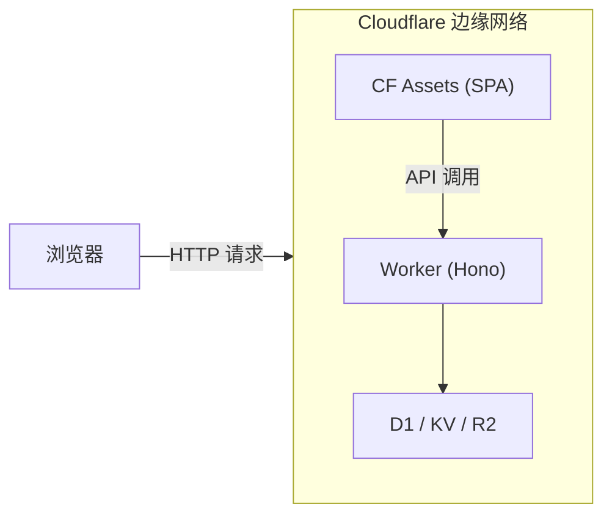
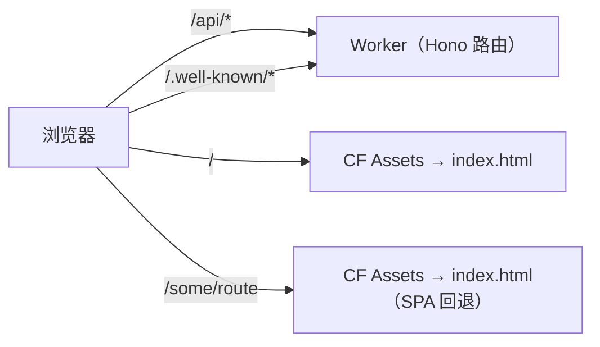
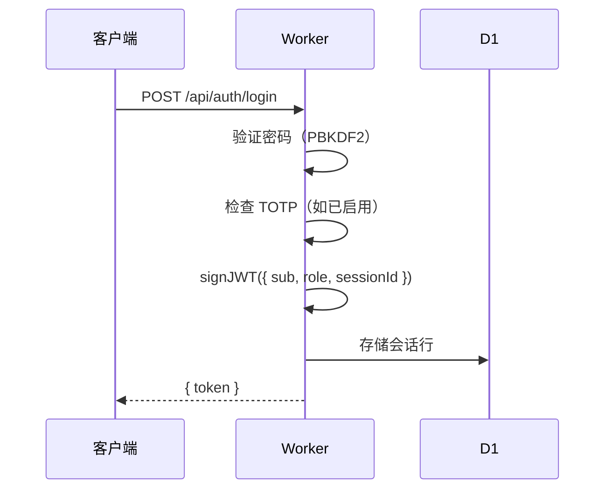
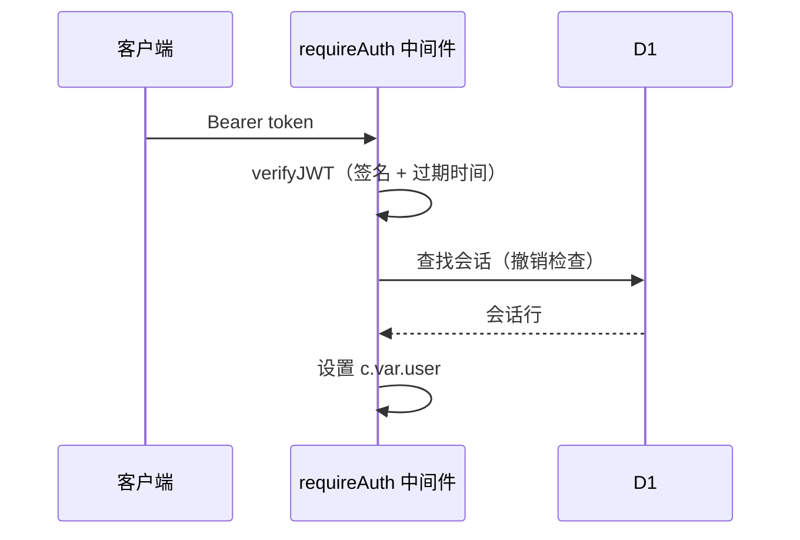

# 架构

## 概览

Prism 是一个 monorepo，包含两个主要部分：

- **后端**（`worker/`）——使用 [Hono](https://hono.dev) 编写的 Cloudflare Worker（TypeScript）
- **前端**（`src/`）——由 Vite 构建、通过 Cloudflare Assets 提供服务的 React SPA



一次 `wrangler deploy` 即可同时发布 Worker 和构建后的前端资产。Cloudflare 的资产服务会处理 SPA 回退（所有未知路径均返回 `index.html`）。

## 请求流程



开发环境中，Vite 将 `/api/*` 代理到 `http://localhost:8787`，因此无需修改任何 URL，本地和生产环境使用同一套代码。

## Worker 结构

```text
worker/
├── index.ts              # 应用入口；CORS、secureHeaders、路由挂载
├── types.ts              # D1 行类型、Variables、SiteConfig
│
├── db/migrations/
│   └── 0001_init.sql     # 完整 schema + 默认 site_config 行
│
├── lib/
│   ├── config.ts         # getConfig()、setConfigValues() — 基于 D1 的键值存储
│   ├── crypto.ts         # randomId、hashPassword/verifyPassword（PBKDF2）、verifyPoW
│   ├── email.ts          # sendEmail() — Resend / Mailchannels 适配器
│   ├── jwt.ts            # signJWT / verifyJWT — 基于 Web Crypto 的 HS256
│   ├── totp.ts           # TOTP / HOTP（RFC 6238）、备用码
│   └── webauthn.ts       # 通过 @simplewebauthn/server 实现 Passkey 注册/认证
│
├── middleware/
│   ├── auth.ts           # requireAuth、requireAdmin、optionalAuth
│   ├── captcha.ts        # verifyCaptchaToken() — 分发到各提供商
│   └── rateLimit.ts      # 基于 KV 的滑动窗口限流
│
└── routes/
    ├── init.ts           # 首次初始化
    ├── auth.ts           # 注册、登录、TOTP、Passkeys、会话
    ├── oauth.ts          # 授权服务器、令牌端点、OIDC
    ├── apps.ts           # OAuth 应用 CRUD
    ├── domains.ts        # 域名验证
    ├── connections.ts    # 社交 OAuth 流程
    ├── user.ts           # 个人资料、头像、密码、注销账号
    └── admin.ts          # 管理员：配置、用户、应用、审计日志
```

## 数据模型

### `users`

核心身份记录。`password_hash` 可为空（通过社交登录创建的账号无密码）。`role` 为 `user` 或 `admin`。

### `sessions`

存储 JWT `sessionId` 声明的 SHA-256 哈希。登出或管理员撤销时，该行被删除——即使 JWT 尚未过期也会失效，因为中间件会在 KV/D1 中检查会话是否存在。

> 目前会话在每次请求时通过 KV 查找进行验证。D1 中也保留了会话行，供管理员查看。

### `totp_secrets`

每个用户一行。`enabled = 0` 表示设置流程尚未完成（未经验证）。`backup_codes` 是一个存储 bcrypt 哈希码的 JSON 数组。

### `passkeys`

WebAuthn 凭据。`credential_id` 为 base64url 编码。`counter` 字段在每次成功认证时更新，用于克隆检测。

### `oauth_apps`

用户注册的应用。`client_secret` 明文存储（`client_secret_basic`/`client_secret_post` 认证所必需）。`is_verified` 由管理员设置。

### `oauth_codes`

短期授权码（有效期 10 分钟），交换后删除。

### `oauth_tokens`

访问令牌和刷新令牌。`access_token` 是一个随机不透明字符串。实际颁发给客户端的 JWT 将 `access_token` 嵌入作为 payload，以便无需 DB 查找即可直接验证。

### `oauth_consents`

记录用户已为某客户端批准的权限范围，用于跳过重复授权的确认页面。

### `domains`

用户添加的域名，用于 OAuth 重定向 URI 验证。通过 DNS TXT 记录 `_prism-verify.<domain>` 进行验证。`next_reverify_at` 根据 `domain_reverify_days` 配置项设置。

### `social_connections`

已关联的社交提供商账号。`(user_id, provider)` 唯一——每个用户每个提供商只能关联一个账号。`(provider, provider_user_id)` 也唯一，防止同一社交账号关联到多个 Prism 账号。

### `site_config`

所有运行时配置的扁平键值存储。值以 JSON 编码字符串存储，布尔值和数字可正确往返。

### `audit_log`

重要操作的追加型日志（登录、注册、配置变更等）。

## 认证流程



每次已认证请求：



## PoW（工作量证明）

PoW 系统是第三方验证码服务的替代方案。

1. `GET /api/auth/pow-challenge` — 服务端生成 32 字节随机挑战，存入 KV（TTL 10 分钟），返回 `{ challenge, difficulty }`
2. 客户端在 Web Worker 中调用 `solvePoW(challenge, difficulty)` — 尝试 nonce，直到 `SHA-256(challenge + nonce_be32)` 具有 `difficulty` 个前导零位
3. 客户端将 `{ pow_challenge, pow_nonce }` 与注册/登录请求一并提交
4. 服务端调用 `verifyPoW()` 并在 KV 中检查挑战（使用后删除以防重放攻击）

从 `pow/src/lib.rs` 编译的 WASM 模块（`public/pow.wasm`）可将求解速度提升约 10 倍。纯 JS 回退（`src/lib/pow.ts`）用于 WASM 不可用的情况。

## 安全说明

- 所有密码学操作均使用 **Web Crypto API**——不依赖 Node.js `crypto` 模块
- 密码使用 **PBKDF2** 哈希（100,000 次迭代，SHA-256，16 字节随机盐）
- JWT 使用 **HMAC-SHA256** 签名
- TOTP 按 RFC 6238 使用 **HMAC-SHA1**，允许 ±1 步长窗口
- PKCE 使用 **S256**（向后兼容也接受 plain）
- 限流使用基于 KV 的滑动窗口
- 会话 `sessionId` 以哈希形式存储——即使数据库被入侵也无法推导出有效令牌
