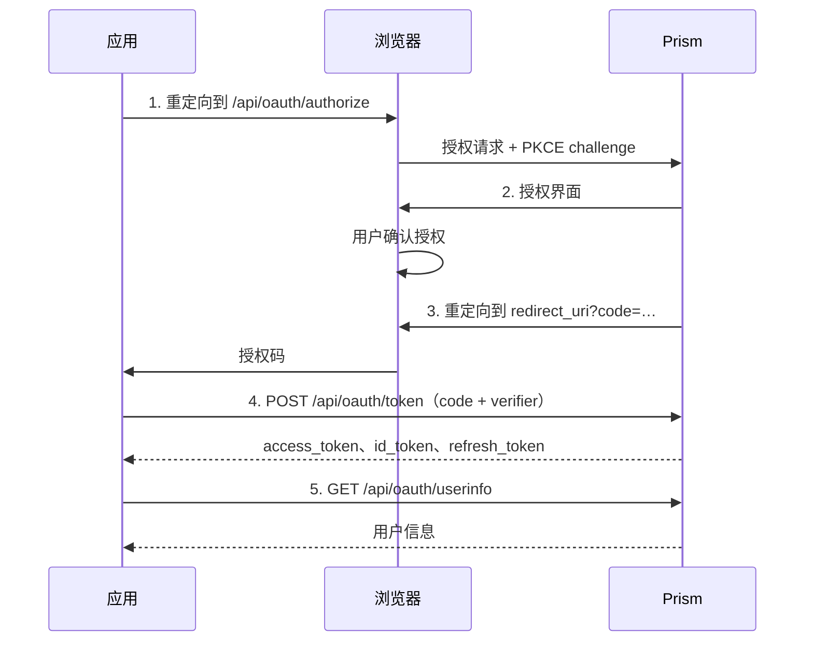

Prism 是一个符合标准的 OAuth 2.0 授权服务器和 OpenID Connect 提供商。任何支持 OAuth 2.0 授权码流程的应用都可以使用 Prism 作为其身份提供商。

## Discovery

OpenID Connect Discovery 文档位于：

```text
https://your-prism-domain/.well-known/openid-configuration
```

大多数 OAuth/OIDC 库可以从此 URL 自动完成配置。

## 注册应用程序

1. 登录 Prism，前往 **Apps → New Application**
2. 填写名称、描述和重定向 URI
3. 复制 **Client ID** 和 **Client Secret**——密钥仅显示一次

如果你的应用完全运行在浏览器端（没有服务端来保密密钥），请启用**公共客户端**。公共客户端必须使用 PKCE，没有客户端密钥。

## 授权码流程（含 PKCE）



### 第一步 — 重定向用户

```text
GET https://your-prism-domain/api/oauth/authorize
  ?response_type=code
  &client_id=<CLIENT_ID>
  &redirect_uri=https://yourapp.com/callback
  &scope=openid profile email
  &state=<RANDOM_STATE>
  &code_challenge=<CODE_CHALLENGE>
  &code_challenge_method=S256
```

**PKCE** — 生成一个 `code_verifier`（43–128 个随机 URL 安全字符），然后：

```text
code_challenge = BASE64URL(SHA-256(ASCII(code_verifier)))
```

#### 权限范围

| 范围 | 包含的声明 / 授权的访问 |
| --- | --- |
| `openid` | `sub`、`iss`、`aud`、`iat`、`exp`（OIDC 必须） |
| `profile` | `name`、`preferred_username`、`picture` |
| `profile:write` | 更新用户的个人资料（名称、头像） |
| `email` | `email`、`email_verified` |
| `apps:read` | 用户拥有的应用列表 |
| `apps:write` | 创建、更新和删除用户的应用 |
| `teams:read` | 列出用户的团队 |
| `teams:write` | 更新团队设置和管理成员 |
| `teams:create` | 创建新团队 |
| `teams:delete` | 删除团队 |
| `domains:read` | 列出用户的自定义域名 |
| `domains:write` | 添加和删除自定义域名 |
| `gpg:read` | 列出用户已注册的 GPG 公钥 |
| `gpg:write` | 添加或删除用户的 GPG 公钥 |
| `social:read` | 列出用户已关联的社交提供商账号 |
| `social:write` | 断开社交提供商账号关联 |
| `webhooks:read` | 列出用户的 Webhook |
| `webhooks:write` | 创建、更新和删除 Webhook |
| `admin:users:read` | 读取所有用户账号（仅限管理员） |
| `admin:users:write` | 修改用户账号（仅限管理员） |
| `admin:users:delete` | 删除用户账号（仅限管理员） |
| `admin:config:read` | 读取实例配置（仅限管理员） |
| `admin:config:write` | 更新实例配置（仅限管理员） |
| `admin:invites:read` | 列出邀请（仅限管理员） |
| `admin:invites:create` | 创建邀请（仅限管理员） |
| `admin:invites:delete` | 删除邀请（仅限管理员） |
| `admin:webhooks:read` | 列出实例级别的 Webhook（仅限管理员） |
| `admin:webhooks:write` | 创建和更新实例级别的 Webhook（仅限管理员） |
| `admin:webhooks:delete` | 删除实例级别的 Webhook（仅限管理员） |
| `offline_access` | 启用刷新令牌颁发 |

### 第二步 — 用户授权

Prism 显示授权页面，列出你的应用名称和请求的权限范围。如果用户已经对相同的权限范围授权过，则自动跳过授权页面。

### 第三步 — 接收授权码

Prism 重定向到你的 `redirect_uri`：

```text
https://yourapp.com/callback?code=<AUTH_CODE>&state=<STATE>
```

请务必验证 `state` 与你发送的值一致。

### 第四步 — 换取令牌

```http
POST /api/oauth/token
Content-Type: application/x-www-form-urlencoded

grant_type=authorization_code
&code=<AUTH_CODE>
&redirect_uri=https://yourapp.com/callback
&client_id=<CLIENT_ID>
&client_secret=<CLIENT_SECRET>
&code_verifier=<CODE_VERIFIER>
```

公共客户端省略 `client_secret`，必须包含 `code_verifier`。

#### 响应

```json
{
  "access_token": "...",
  "token_type": "Bearer",
  "expires_in": 3600,
  "refresh_token": "...",
  "id_token": "...",
  "scope": "openid profile email"
}
```

### 第五步 — 调用 UserInfo

```http
GET /api/oauth/userinfo
Authorization: Bearer <ACCESS_TOKEN>
```

#### UserInfo 响应

```json
{
  "sub": "user-id",
  "name": "Alice",
  "preferred_username": "alice",
  "email": "alice@example.com",
  "email_verified": true,
  "picture": "https://your-prism-domain/api/assets/avatars/..."
}
```

## 刷新令牌

```http
POST /api/oauth/token
Content-Type: application/x-www-form-urlencoded

grant_type=refresh_token
&refresh_token=<REFRESH_TOKEN>
&client_id=<CLIENT_ID>
&client_secret=<CLIENT_SECRET>
```

## 令牌内省（RFC 7662）

用于服务端间验证，无需解析 JWT：

```http
POST /api/oauth/introspect
Content-Type: application/x-www-form-urlencoded
Authorization: Basic <base64(client_id:client_secret)>

token=<ACCESS_TOKEN>
```

### 响应（有效令牌）

```json
{
  "active": true,
  "sub": "user-id",
  "scope": "openid profile",
  "client_id": "...",
  "exp": 1234567890,
  "iat": 1234564290
}
```

## 令牌撤销（RFC 7009）

```http
POST /api/oauth/revoke
Content-Type: application/x-www-form-urlencoded

token=<ACCESS_OR_REFRESH_TOKEN>
&client_id=<CLIENT_ID>
&client_secret=<CLIENT_SECRET>
```

## ID 令牌

ID 令牌是一个签名的 JWT（RS256）。可通过 `/.well-known/jwks.json` 发布的公钥进行验证，或使用内省端点进行服务端验证。

标准声明（请求 `openid` 权限范围时始终包含）：

| 声明 | 值 |
| --- | --- |
| `iss` | 你的 Prism 实例 URL |
| `sub` | 稳定的用户 ID |
| `aud` | 你的 `client_id` |
| `iat` | 颁发时间戳 |
| `exp` | 过期时间戳 |
| `role` | 用户角色（`user` 或 `admin`） |
| `nonce` | 从授权请求中原样返回 |

范围关联声明 — `profile` 和 `email` 声明在授予对应权限范围时自动包含。下表中其余声明还需要应用在 `oidc_fields` 配置中声明对应的字段名：

| 权限范围 | 字段名 | 添加到 ID 令牌的声明 |
| --- | --- | --- |
| `profile` | _（始终包含）_ | `name`、`preferred_username`、`picture` |
| `email` | _（始终包含）_ | `email`、`email_verified` |
| `teams:read` | `teams` | `teams` — `{ id, name, role }` 对象数组，表示用户的团队成员身份 |
| `apps:read` | `apps` | `apps` — `{ id, name, client_id, is_verified }` 对象数组，表示用户拥有的应用 |
| `domains:read` | `domains` | `domains` — `{ id, domain, verified }` 对象数组 |
| `gpg:read` | `gpg_keys` | `gpg_keys` — `{ id, fingerprint, key_id, name }` 对象数组 |
| `social:read` | `social_accounts` | `social_accounts` — `{ id, provider, provider_user_id }` 对象数组 |

通过 API 创建或更新应用时，在 `oidc_fields` 数组中声明所需字段，即可为该应用启用相应的自定义声明：

```json
{ "oidc_fields": ["teams", "domains"] }
```

## 加强 2FA（敏感操作再确认）

应用可以请求 Prism 让用户在执行敏感操作前用 TOTP 或通行密钥再确认一次——例如转账、删除资源、授予提权访问权限等。

流程是**服务端发起**的：你的服务器先通过 HTTPS 把这次操作注册到 Prism，然后才重定向用户。操作描述和回调 URI 都在服务端到服务端这一步固定下来——只控制 URL 的攻击者无法伪造一个写有任意内容的确认页。

用户必须已登录 Prism（未登录会被引导登录），并已启用 TOTP 认证器或通行密钥。这一过程不会授予任何新的账户权限——返回结果只是用户重新确认了一次的一次性凭证。

### 第一步 — 创建挑战（服务端到服务端）

```http
POST /api/oauth/2fa/challenges
Authorization: Basic <base64(client_id:client_secret)>
Content-Type: application/json

{
  "redirect_uri": "https://app.example.com/2fa-callback",
  "action": "确认转账 $1,000",
  "nonce": "order_abc123",
  "code_challenge": "PKCE_CHALLENGE",
  "code_challenge_method": "S256"
}
```

| 字段 | 是否必填 | 说明 |
| --- | --- | --- |
| `client_id` | 必填（Basic 或请求体） | OAuth 应用的 client ID |
| `client_secret` | 机密客户端必填 | 通过 Basic 或请求体提供 |
| `redirect_uri` | 必填 | 必须已在应用上注册 |
| `action` | 推荐 | 用户要确认的操作的人类可读描述（≤ 200 字符）。在 Prism 页面原样展示，并在 verify 响应中回传 |
| `nonce` | 可选 | 应用自定义的不透明值（≤ 256 字符），原样回传。建议绑定到具体操作（如订单 ID） |
| `code_challenge`, `code_challenge_method` | 公开客户端必填 | PKCE — 见授权码流程 |

#### 响应

```json
{
  "challenge_id": "f3a…opaque…",
  "expires_at": 1761500900,
  "url": "https://prism.example.com/oauth/2fa?challenge_id=f3a…"
}
```

公开客户端（无 `client_secret`）依靠 PKCE 进行身份认证：在这里传 `code_challenge`，在校验时传 `code_verifier`。服务器对每个客户端限速创建挑战（每分钟 60 次），即便密钥泄露也无法用于骚扰用户。

### 第二步 — 重定向用户

```text
https://prism.example.com/oauth/2fa?challenge_id=f3a…&state=RANDOM
```

URL 里只有不透明的 `challenge_id` 和你设的 CSRF `state`。攻击者没有任何可篡改的内容。

### 第三步 — 用户确认

Prism 会展示应用图标、（如适用的）已验证域名徽章、来自挑战的 `action` 文案，并提示用户输入 TOTP 或使用通行密钥。用户还必须勾选一个回显操作内容的复选框（"我已阅读并理解：…"），「确认」按钮才会启用。

用户点击 **确认** 或 **拒绝**。

### 第四步 — 接收 code

Prism 将用户重定向回挑战中固定的 `redirect_uri`：

```text
https://app.example.com/2fa-callback?code=…&state=…
```

或在拒绝/出错时：

```text
https://app.example.com/2fa-callback?error=access_denied&state=…
```

### 第五步 — 校验（服务端）

```http
POST /api/oauth/2fa/verify
Content-Type: application/x-www-form-urlencoded

code=THE_CODE&client_id=YOUR_CLIENT_ID&redirect_uri=…&code_verifier=PKCE_VERIFIER
```

机密客户端可用 `client_secret`（请求体）或 HTTP Basic 认证。公开客户端仅依靠 PKCE。

#### 响应

```json
{
  "user_id": "u_abc",
  "client_id": "YOUR_CLIENT_ID",
  "verified_at": 1761500000,
  "action": "确认转账 $1,000",
  "nonce": "order_abc123",
  "method": "totp"
}
```

code 是单次使用的，签发后 5 分钟过期。校验成功后：

- `verified_at` 是用户完成 2FA 的 Unix 时间戳——超过你认可的窗口期就视为过期。
- 将 `nonce` 和 `action` 与你应用最初构造 URL 时存储的值比对——不一致就拒绝结果。
- `method` 是 `"totp"`、`"passkey"` 或 `"backup"`。

### 验证码门槛

站点可以要求用户在批准 2FA 加强前先通过验证码。触发该门槛有两种方式：

- **站点默认** — 管理员开启 `require_captcha_for_2fa`,所有 2FA 加强都需要通过验证码。
- **应用按挑战开启** — 应用在调用 `POST /api/oauth/2fa/challenges` 时传入 `require_captcha: true`。适合在站点默认关闭时,某些应用仍希望对自己的高风险操作增加阻力。（应用无法关闭站点已强制启用的门槛。）

使用站点已配置好的验证码提供商（Turnstile、hCaptcha、reCAPTCHA 或 PoW）。如果 `captcha_provider` 为 `"none"`,即便上述触发条件命中也不会有任何效果。

`/api/oauth/2fa/info` 响应中暴露了 `captcha_required`、`captcha_provider`、`captcha_site_key`,以便前端渲染对应的小部件。用户解决挑战后,把 `captcha_token`（或 `pow_challenge` + `pow_nonce`）连同 TOTP/通行密钥一并提交到 `/api/oauth/2fa/authorize`。

走 sudo 旁路时**不会**触发验证码：sudo 不检查任何因子,没有自动化攻击的面,强制挑战反而会让 sudo 宽限期失去意义。

### Sudo 模式（宽限窗口）

用户在一次成功的 TOTP/通行密钥确认之后,可选择启用 **sudo 宽限窗口**：在此窗口内,同一会话同一应用的后续挑战会跳过 2FA 提示。但操作描述的确认复选框仍然必须勾选——用户始终能看到并确认自己批准的内容,只跳过 TOTP/通行密钥的重新输入。

TTL 由管理员通过 `sudo_mode_ttl_minutes` 站点设置控制。设为 `0` 即可完全禁用 sudo 模式。

授权绑定到 `(user_id, session_id, client_id)` 三元组——不会跨应用、跨会话、跨用户泄露。登出 Prism 会更换 session ID,该会话内所有 sudo 授权随即不可达。

用户启用 sudo 后,Prism 返回的重定向 code 的 `method` 字段为 `"sudo"`。**进行极高风险操作（销户、大额转账）的应用应要求 `method !== "sudo"`**,使这些操作始终触发一次全新的 2FA 提示。

#### 提前撤销 sudo 窗口

用户可在 TTL 到期前主动撤销：

```http
POST /api/oauth/2fa/sudo/revoke
Authorization: Bearer <user-session-jwt>
Content-Type: application/json

{ "client_id": "YOUR_CLIENT_ID" }
```

### 威胁模型

可防御的攻击：

- **仅靠 URL 的钓鱼。** 仅能构造 URL 的攻击者（如钓鱼邮件中的链接）无法注入任意 action 文案或挑选任意 redirect URI——这两者都在第 1 步在服务端固定，攻击者拿不到应用的 `client_secret`（或公开客户端的应用本身）就够不到这一步。
- **code 拦截。** PKCE 将 code 与 verifier 绑定；code 还与 `(client_id, redirect_uri)` 绑定。即使 code 泄露（如通过 referrer），也无法被其他应用兑换或发送到其他 URI。
- **TOTP 暴力破解。** 每用户 5 分钟限速 8 次。一次失败也会消耗当前挑战——攻击者必须重新走一次服务端发起的 POST 才能重试。
- **重放 / 重复兑换。** 挑战和生成的 code 都通过原子操作（`UPDATE … WHERE consumed_at IS NULL`）单次消费。
- **盲目点击。** 用户必须显式勾选回显 action 文案的复选框，「确认」按钮才会启用。
- **UI 欺骗。** `action`、`nonce`、`state` 都有长度上限，避免恶意应用通过 UI 投放超长内容欺骗用户。

**无法**防御：

- 设备完全失陷（恶意软件可读取屏幕上的 TOTP 验证码并窃取会话 Cookie——任何认证流程都救不了你）。
- 同时拥有应用 `client_secret` 且被授权代表该应用行事的攻击者，他们可以发起合法挑战。如怀疑泄露请立即轮换密钥。

## 集成

### Cloudflare Access

你可以将 Prism 作为 [Cloudflare Access](https://developers.cloudflare.com/cloudflare-one/identity/idp-integration/generic-oidc/) 的通用 OIDC 身份提供商，让用户使用 Prism 账号登录受 Cloudflare 保护的资源。

#### 第一步 — 在 Prism 中创建 OAuth 应用

1. 登录 Prism，前往 **Apps → New Application**
2. 将重定向 URI 设置为：

   ```text
   https://<your-team-name>.cloudflareaccess.com/cdn-cgi/access/callback
   ```

3. **Allowed scopes** 至少包含 `openid` 和 `email`，如需在 Access 策略中使用其他声明，可添加 `profile`、`teams:read` 等。
4. **OIDC fields** 设置为需要嵌入 ID 令牌的自定义声明字段名，例如 `["role", "teams"]`。
5. 复制 **Client ID** 和 **Client Secret**。

#### 第二步 — 在 Cloudflare 中添加 Prism 为身份提供商

在 [Cloudflare Zero Trust](https://one.dash.cloudflare.com/) 中，前往 **Integrations → Identity providers → Add new → OpenID Connect**，填写以下内容：

| 字段 | 值 |
| --- | --- |
| Name | Prism（或任意名称） |
| App ID | 你的 Prism **Client ID** |
| Client secret | 你的 Prism **Client Secret** |
| Auth URL | `https://your-prism-domain/api/oauth/authorize` |
| Token URL | `https://your-prism-domain/api/oauth/token` |
| Certificate URL | `https://your-prism-domain/.well-known/jwks.json` |
| PKCE | 启用（推荐） |
| Scopes | `openid email`（按需添加 `profile teams:read` 等） |
| OIDC Claims | 每行一个 — 需要在策略中使用的声明名 |

在 **OIDC Claims** 中填入 Prism 返回的自定义声明名，例如：

```text
role
in_team_<team-id>
role_in_team_<team-id>
```

保存后点击 **Test** 验证连接。成功后可在 `oidc_fields` 中看到声明：

```json
{
  "email": "alice@example.com",
  "oidc_fields": {
    "role": "admin",
    "in_team_abc123": true,
    "role_in_team_abc123": "owner"
  }
}
```

#### 第三步 — 使用 Prism 声明构建 Access 策略

在 Access 应用策略中使用 **OIDC Claim** 选择器：

| 选择器 | Claim name | Claim value | 效果 |
| --- | --- | --- | --- |
| OIDC Claim | `role` | `admin` | 仅限 Prism 管理员 |
| OIDC Claim | `in_team_<team-id>` | `true` | 指定团队成员 |
| OIDC Claim | `role_in_team_<team-id>` | `owner` | 仅限团队所有者 |

> **注意：** Cloudflare Access 从 **ID 令牌**（RS256 签名的 JWT）中读取自定义声明。Dashboard 中填写的声明名必须与 Prism 实际嵌入令牌的字段名完全一致，后者由应用的 `oidc_fields` 配置决定。

## 错误响应

授权错误会重定向到你的 `redirect_uri`，附带：

```text
?error=access_denied&error_description=User+denied+access
```

令牌端点错误返回 HTTP 400：

```json
{ "error": "invalid_grant", "error_description": "Code expired or invalid" }
```

常见错误码：`invalid_request`、`invalid_client`、`invalid_grant`、`unauthorized_client`、`unsupported_grant_type`、`access_denied`。
