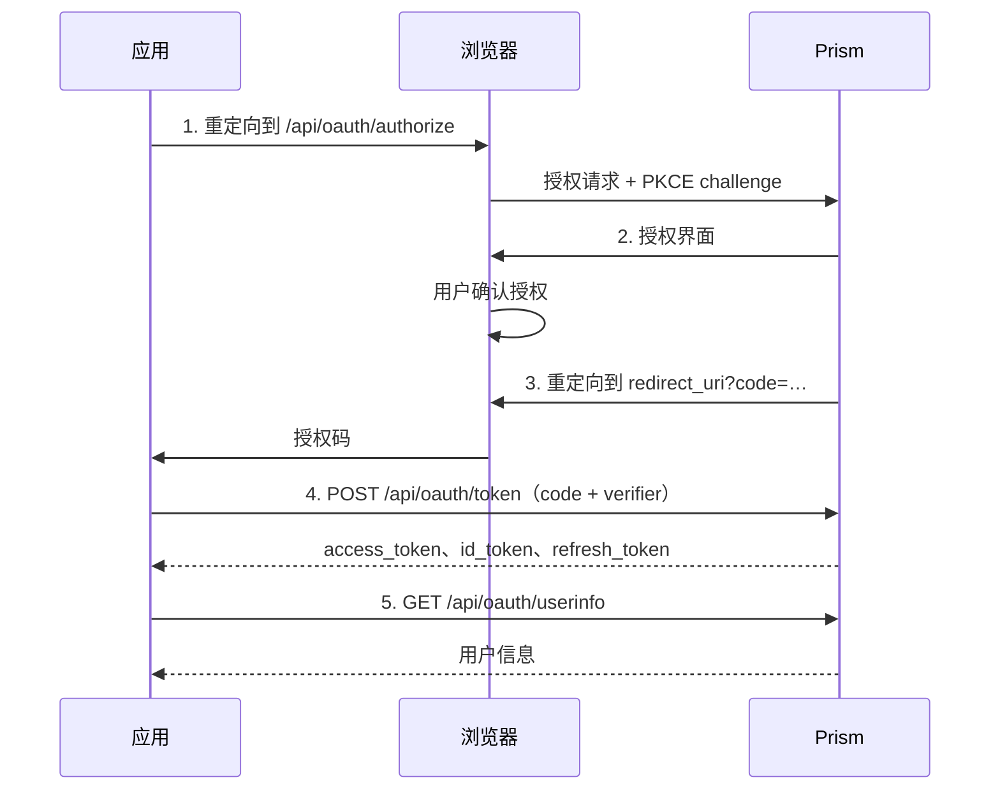

Prism 是一个符合标准的 OAuth 2.0 授权服务器和 OpenID Connect 提供商。任何支持 OAuth 2.0 授权码流程的应用都可以使用 Prism 作为其身份提供商。

## Discovery

Prism 在两个 well-known 位置发布提供方元数据：

```text
https://your-prism-domain/.well-known/openid-configuration      # OpenID Connect Discovery 1.0
https://your-prism-domain/.well-known/oauth-authorization-server # RFC 8414
```

两份文档描述的是同一组端点。大多数 OAuth/OIDC 库可以从任一 URL 自动完成配置。

## 注册应用程序

1. 登录 Prism，前往 **Apps → New Application**
2. 填写名称、描述和重定向 URI
3. 复制 **Client ID** 和 **Client Secret**——密钥仅显示一次

如果你的应用完全运行在浏览器端（没有服务端来保密密钥），请启用**公共客户端**。公共客户端必须使用 PKCE，没有客户端密钥。

### 重定向 URI 匹配

每个注册的重定向 URI 都带有一个**匹配方式**：

| 类型     | 行为                                                                  |
| -------- | --------------------------------------------------------------------- |
| `等于`   | URL 规范化后精确匹配（默认，最安全）。                                |
| `通配符` | 使用 `*` 代表任意长度字符的 glob，例如 `https://example.com/*`。      |
| `正则`   | 对整个候选 URI 进行匹配的正则表达式，例如 `https://example\.com/.*`。 |

无论使用哪种匹配方式，每个候选 URI 都会先经过安全校验：scheme 必须为 `https:`（loopback 主机可用 `http:`），且不得包含 userinfo（`user:pass@…`）或 fragment（`#…`）。

**空列表（学习首次使用）。** 如果重定向 URI 列表留空，应用会「学习」第一个成功使用的重定向 URI，将其固定为 `等于` 条目，此后锁定为该值。

::: warning
值为 `.*` 的 `正则` 会允许**任意**重定向 URI，包括攻击者控制的地址。请仅在完全理解安全风险的情况下使用。
:::

## 授权码流程（含 PKCE）


```mermaid
sequenceDiagram
  participant App as 应用
  participant Browser as 浏览器
  participant Prism

  App->>Browser: 1. 重定向到 /api/oauth/authorize
  Browser->>Prism: 授权请求 + PKCE challenge
  Prism->>Browser: 2. 授权界面
  Browser->>Browser: 用户确认授权
  Prism->>Browser: 3. 重定向到 redirect_uri?code=…
  Browser->>App: 授权码
  App->>Prism: 4. POST /api/oauth/token（code + verifier）
  Prism-->>App: access_token、id_token、refresh_token
  App->>Prism: 5. GET /api/oauth/userinfo
  Prism-->>App: 用户信息
```

### 第一步 — 重定向用户

```text
GET https://your-prism-domain/api/oauth/authorize
  ?response_type=code
  &client_id=<CLIENT_ID>
  &redirect_uri=https://yourapp.com/callback
  &scope=openid profile email
  &state=<RANDOM_STATE>
  &code_challenge=<CODE_CHALLENGE>
  &code_challenge_method=S256
```

**PKCE** — 生成一个 `code_verifier`（43–128 个随机 URL 安全字符），然后：

```text
code_challenge = BASE64URL(SHA-256(ASCII(code_verifier)))
```

#### 权限范围

| 范围                   | 包含的声明 / 授权的访问                        |
| ---------------------- | ---------------------------------------------- |
| `openid`               | `sub`、`iss`、`aud`、`iat`、`exp`（OIDC 必须） |
| `profile`              | `name`、`preferred_username`、`picture`        |
| `profile:write`        | 更新用户的个人资料（名称、头像）               |
| `email`                | `email`、`email_verified`                      |
| `apps:read`            | 用户拥有的应用列表                             |
| `apps:write`           | 创建、更新和删除用户的应用                     |
| `teams:read`           | 列出用户的团队                                 |
| `teams:write`          | 更新团队设置和管理成员                         |
| `teams:create`         | 创建新团队                                     |
| `teams:delete`         | 删除团队                                       |
| `domains:read`         | 列出用户的自定义域名                           |
| `domains:write`        | 添加和删除自定义域名                           |
| `gpg:read`             | 列出用户已注册的 GPG 公钥                      |
| `gpg:write`            | 添加或删除用户的 GPG 公钥                      |
| `social:read`          | 列出用户已关联的社交提供商账号                 |
| `social:write`         | 断开社交提供商账号关联                         |
| `admin:users:read`     | 读取所有用户账号（仅限管理员）                 |
| `admin:users:write`    | 修改用户账号（仅限管理员）                     |
| `admin:users:delete`   | 删除用户账号（仅限管理员）                     |
| `admin:config:read`    | 读取实例配置（仅限管理员）                     |
| `admin:config:write`   | 更新实例配置（仅限管理员）                     |
| `admin:invites:read`   | 列出邀请（仅限管理员）                         |
| `admin:invites:create` | 创建邀请（仅限管理员）                         |
| `admin:invites:delete` | 删除邀请（仅限管理员）                         |
| `offline_access`       | 启用刷新令牌颁发                               |

#### 团队相关 scope —— 三个层级

涉及团队的 scope 分三类，作用范围差异巨大。请按需选最窄的那一类。

| 层级           | 示例             | 访问范围               | 授予方式                                                 |
| -------------- | ---------------- | ---------------------- | -------------------------------------------------------- |
| 聚合（复数）   | `teams:read`     | 用户加入的所有团队     | 普通用户同意                                             |
| 单团队（单数） | `team:read`      | 同意时选定的某一个团队 | 普通用户同意 + 团队选择器（用户须是该团队 admin 及以上） |
| 跨实例         | `site:team:read` | 实例上所有团队         | 仅管理员，且需通过 2FA + 输入确认短语                    |

##### 聚合 `teams:*`

```
teams:read   teams:write   teams:create   teams:delete
```

作用于用户的全部团队图谱。一次同意覆盖所有团队。适合需要反映或同步用户成员关系的场景 — 例如把 [`teams` claim](#id-token) 注入到 ID Token 给 Cloudflare Access 用，或者展示一个「我所在的团队」切换器。

端点位于 `/api/oauth/me/teams[/...]`。

##### 单团队 `team:*`

```
team:read                       team:member:read
team:write                      team:member:write
team:delete                     team:member:profile:read
```

应用*请求*时使用上面这些字符串。同意时用户挑出**一个具体团队**，Prism 通过 `bindTeamScopes()` 把它们就地改写成 `team:<team-id>:read` 等 — 颁发的 token 里只剩绑定后的形式，从而只能作用于那一个团队。

同意时还有两条额外限制（`worker/routes/oauth.ts:830-859`）：

- 用户必须是所选团队的 `owner`、`co-owner` 或 `admin`。**有效角色同样适用** —— 通过上级团队继承得到的 admin 也可以在子团队上授予单团队 scope（与会话 API 一致）。同意页的团队选择器会列出该用户能管理的所有团队，无论是直接还是继承。
- `team:delete` 还要求 `owner` 或 `co-owner`（admin 能授予读写，但只有真正能解散团队的人才能授予删除权）。继承的 owner 同样可以授予 `team:delete`，递归的 [`dissolveTeam` 级联](teams.md#子团队-递归嵌套) 会完整执行。

`team:member:write` 同样不能越权：admin 用户授权后，应用提升成员的角色受到与该 admin 相同的上限保护，不会因 token 而获得超越授权人本身的能力 — 这条上限会在每次成员变更时校验。

每次授予都会在 `team_scope_grants` 表中独立审计（含团队 ID 与权限列表），与 OAuth 同意记录分开。

端点位于 `/api/oauth/me/team/:teamId/...`，通过 `resolveTeamToken(c, teamId, "read"|"write"|"member:read"|...)` 校验绑定关系；用绑定到 A 团队的 token 去访问 B 团队的端点会得到 `403 insufficient_scope`。

##### 跨实例 `site:team:*`

```
site:team:read   site:team:write   site:team:delete
```

无需逐团队同意的跨团队管理员权限。授予时同意者必须是站点管理员，并通过 [站点 scope 确认流程](#site-scopes-admin-only) — 2FA + 完整输入 `grant site access` 这一确认短语。仅适合真的需要看 / 改全部团队的站点管理工具。

##### 选哪一种 — 速记

- 「这个用户在哪些团队？」用 **`teams:*`**。绑定到单个团队的集成（如某 workspace 的部署机器人）用 **`team:*`**。
- 不要同时请求 `teams:*` 和 `team:*` — 你会拿到两者的并集，但同意页里同时出现「团队选择器」和「全部团队提示」会让用户困惑。
- **`site:team:*`** 是给站点管理工具用的，不要给产品集成用。这层的授予会绕过团队所有者的同意。

#### 站点 scope（仅管理员）

完整的跨实例 scope 列表；与 `site:team:*` 共用 admin-only / 2FA / 确认短语 的同一道关卡：

| Scope               | 权限                       |
| ------------------- | -------------------------- |
| `site:user:read`    | 读取任意用户               |
| `site:user:write`   | 修改任意用户               |
| `site:user:delete`  | 删除任意用户               |
| `site:team:read`    | 读取任意团队               |
| `site:team:write`   | 修改任意团队               |
| `site:team:delete`  | 解散任意团队               |
| `site:config:read`  | 读取站点配置               |
| `site:config:write` | 修改站点配置               |
| `site:token:revoke` | 撤销任意用户的 OAuth token |

### 第二步 — 用户授权

Prism 显示授权页面，列出你的应用名称和请求的权限范围。如果用户已经对相同的权限范围授权过，则自动跳过授权页面。

### 第三步 — 接收授权码

Prism 重定向到你的 `redirect_uri`：

```text
https://yourapp.com/callback?code=<AUTH_CODE>&state=<STATE>
```

请务必验证 `state` 与你发送的值一致。

### 第四步 — 换取令牌

```http
POST /api/oauth/token
Content-Type: application/x-www-form-urlencoded

grant_type=authorization_code
&code=<AUTH_CODE>
&redirect_uri=https://yourapp.com/callback
&client_id=<CLIENT_ID>
&client_secret=<CLIENT_SECRET>
&code_verifier=<CODE_VERIFIER>
```

公共客户端省略 `client_secret`，必须包含 `code_verifier`。

#### 响应

```json
{
  "access_token": "...",
  "token_type": "Bearer",
  "expires_in": 3600,
  "refresh_token": "...",
  "id_token": "...",
  "scope": "openid profile email"
}
```

### 第五步 — 调用 UserInfo

```http
GET /api/oauth/userinfo
Authorization: Bearer <ACCESS_TOKEN>
```

该端点同时支持 `GET` 与 `POST`（OpenID Connect Core §5.3.1）。访问令牌必须携带
`openid` 作用域；缺少该作用域的令牌会返回 `403 insufficient_scope`。被拒绝的请求
会按 RFC 6750 返回 `WWW-Authenticate: Bearer` 质询头。

#### UserInfo 响应

```json
{
  "sub": "user-id",
  "name": "Alice",
  "preferred_username": "alice",
  "email": "alice@example.com",
  "email_verified": true,
  "picture": "https://your-prism-domain/api/assets/avatars/..."
}
```

## 刷新令牌

```http
POST /api/oauth/token
Content-Type: application/x-www-form-urlencoded

grant_type=refresh_token
&refresh_token=<REFRESH_TOKEN>
&client_id=<CLIENT_ID>
&client_secret=<CLIENT_SECRET>
```

响应中会返回**新的** `refresh_token`，请用它替换原有的令牌。刷新令牌每次使用后
都会轮换，出示已被替换的旧令牌会导致整个授权被撤销——无论是客户端保留了旧值，
还是令牌遭到窃取，处理方式都一样。新令牌沿用原有的过期时间，轮换不会延长授权
有效期。

## 令牌内省（RFC 7662）

用于服务端间验证，无需解析 JWT：

```http
POST /api/oauth/introspect
Content-Type: application/x-www-form-urlencoded
Authorization: Basic <base64(client_id:client_secret)>

token=<ACCESS_TOKEN>
```

必须提供客户端凭据，且客户端只能内省签发给自己的令牌，其他令牌一律返回
`{"active": false}`。

### 响应（有效令牌）

```json
{
  "active": true,
  "sub": "user-id",
  "scope": "openid profile",
  "client_id": "...",
  "token_type": "Bearer",
  "exp": 1234567890,
  "iat": 1234564290,
  "aud": "...",
  "iss": "https://your-prism-domain"
}
```

## 令牌撤销（RFC 7009）

```http
POST /api/oauth/revoke
Content-Type: application/x-www-form-urlencoded

token=<ACCESS_OR_REFRESH_TOKEN>
&client_id=<CLIENT_ID>
&client_secret=<CLIENT_SECRET>
```

必须提供客户端凭据，且只会撤销该客户端自己的令牌。出示已被替换的刷新令牌会撤销
它所属的整个授权。

## 设备授权（RFC 8628）

适用于无法承载浏览器的输入受限设备（CLI、电视、IoT）。

```http
POST /api/oauth/device_authorization
Content-Type: application/x-www-form-urlencoded

client_id=<CLIENT_ID>
&scope=openid profile
```

响应：

```json
{
  "device_code": "…",
  "user_code": "WDJB-MJHT",
  "verification_uri": "https://your-prism-domain/device",
  "verification_uri_complete": "https://your-prism-domain/device?user_code=WDJB-MJHT",
  "expires_in": 600,
  "interval": 5
}
```

向用户展示 `verification_uri` 与 `user_code`（或便于生成二维码的
`verification_uri_complete`）。同时轮询令牌端点：

```http
POST /api/oauth/token
Content-Type: application/x-www-form-urlencoded

grant_type=urn:ietf:params:oauth:grant-type:device_code
&device_code=<DEVICE_CODE>
&client_id=<CLIENT_ID>
```

在用户操作前，端点返回 `authorization_pending`（轮询过快则返回 `slow_down`）；
轮询间隔不得小于 `interval` 秒。批准后返回常规令牌响应（请求了 `openid` 时含
`id_token`，请求了 `offline_access` 时含 `refresh_token`）。`access_denied`
与 `expired_token` 为终止状态。PKCE 可选：在设备授权请求中带上 `code_challenge`，
轮询时带上对应的 `code_verifier`。设备流不能授予站点级与团队级 scope。

## 动态客户端注册（RFC 7591 / 7592）

以编程方式注册客户端。请求需携带初始访问令牌——已登录用户的会话令牌，或带
`apps:write` 的个人访问令牌：

```http
POST /api/oauth/register
Authorization: Bearer <SESSION_OR_PAT>
Content-Type: application/json

{
  "client_name": "My CLI",
  "redirect_uris": ["https://app.example.com/callback"],
  "scope": "openid profile email",
  "token_endpoint_auth_method": "client_secret_basic"
}
```

`201` 响应即客户端信息文档：`client_id`、`client_secret`（机密客户端）、一个
`registration_access_token` 与 `registration_client_uri`。之后在该 URI 管理客户端
（RFC 7592）：`GET` 读取、`PUT` 更新、`DELETE` 注销——均以
`Authorization: Bearer <registration_access_token>` 认证。注册 `private_key_jwt`
客户端时，将 `token_endpoint_auth_method` 设为 `private_key_jwt`，并提供 `jwks`
（内联 JWK Set）或 `jwks_uri`。

## private_key_jwt 客户端认证（RFC 7523）

机密客户端可用签名断言代替共享密钥认证。先注册客户端公钥（`jwks` 或
`jwks_uri`），随后在令牌 / PAR / 内省 / 撤销端点发送：

```text
client_assertion_type=urn:ietf:params:oauth:client-assertion-type:jwt-bearer
&client_assertion=<JWT>
```

该断言是一个 JWT，其 `iss` = `sub` = 你的 `client_id`，`aud` = issuer 或令牌端点
URL，`exp` 较短，`jti` 唯一（一次性使用）。支持的签名算法：RS256、ES256、EdDSA。

## DPoP — 发送方约束的令牌（RFC 9449）

把令牌绑定到客户端持有的密钥上，这样即便令牌值被窃取，没有密钥也无法使用。在令牌
请求上发送 `DPoP` 头——一个由客户端密钥签名、头部携带公钥并绑定到本次请求的 JWT：

```http
POST /api/oauth/token
DPoP: <proof-jwt>   # htm=POST, htu=<令牌端点>, iat, jti
Content-Type: application/x-www-form-urlencoded

grant_type=authorization_code&code=...&client_id=...&code_verifier=...
```

响应返回 `"token_type": "DPoP"`，且访问令牌绑定到密钥指纹（`cnf.jkt`）。在资源端，
用 `DPoP` scheme 携带令牌，并附上同时对令牌做哈希（`ath`）的新证明：

```http
GET /api/oauth/userinfo
Authorization: DPoP <ACCESS_TOKEN>
DPoP: <proof-jwt>   # htm=GET, htu=<资源 url>, ath=base64url(sha256(token))
```

以普通 `Bearer` 出示 DPoP 绑定令牌、或缺少匹配证明，都会被拒绝。刷新请求必须重复来自
同一密钥的证明。支持的证明算法：RS256、ES256、EdDSA。

## 令牌交换（RFC 8693）

用一个访问令牌换取另一个——用于应用间的委托：

```http
POST /api/oauth/token
Authorization: Basic <base64(client_id:client_secret)>
Content-Type: application/x-www-form-urlencoded

grant_type=urn:ietf:params:oauth:grant-type:token-exchange
&subject_token=<ACCESS_TOKEN>
&subject_token_type=urn:ietf:params:oauth:token-type:access_token
&scope=openid profile
&resource=https://api.example.com
```

请求方客户端只能交换签发给它自己的令牌，或携带指向它的跨应用 scope
（`app:<client_id>:*`）的令牌。新令牌的 scope 是原 subject 令牌的子集，其受众受
`resource` / `audience` 约束。响应含
`issued_token_type: urn:ietf:params:oauth:token-type:access_token`。交换得到的令牌
不可刷新。

## 重新认证与上下文（`prompt`、`max_age`、`acr`）

授权请求遵循以下 OpenID Connect 参数：

- `prompt=none`——无界面；若用户未登录（或需重新认证）则向客户端返回
  `login_required`，若缺少同意则返回 `consent_required`。
- `prompt=login`——即使已有会话也强制重新登录。
- `prompt=consent`——始终显示同意页。
- `max_age=<秒>`——要求登录时间不早于此，否则重新认证。

ID 令牌随后携带 `auth_time`（用户登录时间）、`amr`（认证方式，如
`["pwd","otp","mfa"]`、`["webauthn"]`、`["ext"]`），以及派生的 `acr`（使用了第二
因子时为 `mfa`，否则为 `pwd`）。

### 提升认证（RFC 9470）

在授权请求上用 `acr_values` 请求特定上下文（例如 `acr_values=mfa`）；若当前会话不满足，
Prism 会重新认证，让更强的因子提升它。访问令牌（以及内省响应）都携带
`acr` / `auth_time` / `amr`，因此资源服务器可以要求更强的认证，并对不满足的请求返回：

```http
HTTP/1.1 401 Unauthorized
WWW-Authenticate: Bearer error="insufficient_user_authentication", acr_values="mfa"
```

客户端随后带 `acr_values=mfa` 重新发起授权。

## 推送式授权请求（RFC 9126）

先把授权参数推送到服务器，换取一次性的 `request_uri` 用于授权端点——请求无法在
浏览器中被篡改，密钥也不会出现在前端信道。

```http
POST /api/oauth/par
Content-Type: application/x-www-form-urlencoded
Authorization: Basic <base64(client_id:client_secret)>

response_type=code
&redirect_uri=<REDIRECT_URI>
&scope=openid profile
&code_challenge=<CHALLENGE>&code_challenge_method=S256
&state=<STATE>
```

响应（`201 Created`）：

```json
{ "request_uri": "urn:ietf:params:oauth:request_uri:…", "expires_in": 90 }
```

随后仅带客户端与 request URI 将用户导向授权端点：

```text
https://your-prism-domain/api/oauth/authorize?client_id=<CLIENT_ID>&request_uri=<REQUEST_URI>
```

`request_uri` 一次性使用且很快过期。

## 授权响应 `iss`（RFC 9207）

每个授权响应（成功与错误）都带有 `iss` 参数，值为你的 Prism 实例 URL。校验它的
客户端可抵御混淆（mix-up）攻击。Discovery 会通告
`authorization_response_iss_parameter_supported: true`。

## 资源指示符（RFC 8707）

在 `/par`、授权或 `/device_authorization` 请求中加入一个或多个 `resource` 参数
（绝对 URI，不含 fragment），用于指明访问令牌面向的资源服务器。每个被接受的值都会
加入令牌的 `aud`，并在刷新时保留。

## RP 发起的登出（OpenID Connect）

```text
GET /api/oauth/end_session?id_token_hint=<ID_TOKEN>&post_logout_redirect_uri=<URI>&state=<STATE>
```

结束用户的 Prism 会话并清除会话 Cookie。当 `post_logout_redirect_uri` 与客户端
注册的某一项（应用的 `post_logout_redirect_uris`）完全匹配时，浏览器会带 `state`
跳转到该地址；否则落到 Prism 内置的登出页。`id_token_hint` 用于标识客户端（即使已
过期也会被接受），建议提供。

## 后端通道登出（OpenID Connect）

为客户端注册 `backchannel_logout_uri`（应用详情 → 设置、DCR 元数据或应用 API）。当
用户从 Prism 登出——通过 `end_session` 或仪表盘——Prism 会向该 URI POST 一个已签名的
`logout_token`：

```http
POST <backchannel_logout_uri>
Content-Type: application/x-www-form-urlencoded

logout_token=<JWT>
```

`logout_token` 是一个 RS256 JWT（`typ: logout+jwt`），含 `iss`、`aud`（你的
`client_id`）、`sub`、`iat`、`jti`、`sid`（结束的会话，也作为 `sid` 出现在 ID 令牌中）
以及后端通道登出的 `events` 声明。请对照 JWKS 验证并终止用户会话。Discovery 会通告
`backchannel_logout_supported` 与 `backchannel_logout_session_supported`。

## ID 令牌

ID 令牌是一个签名的 JWT。默认算法为 **ML-DSA-65**（后量子，FIPS 204）；`/.well-known/jwks.json` 同时发布 **RS256** 公钥以兼容旧客户端。可通过 JWKS 端点发布的公钥进行验证，或使用内省端点进行服务端验证。

标准声明（请求 `openid` 权限范围时始终包含）：

| 声明    | 值                            |
| ------- | ----------------------------- |
| `iss`   | 你的 Prism 实例 URL           |
| `sub`   | 稳定的用户 ID                 |
| `aud`   | 你的 `client_id`              |
| `iat`   | 颁发时间戳                    |
| `exp`   | 过期时间戳                    |
| `role`  | 用户角色（`user` 或 `admin`） |
| `nonce` | 从授权请求中原样返回          |

范围关联声明 — `profile` 和 `email` 声明在授予对应权限范围时自动包含。下表中其余声明还需要应用在 `oidc_fields` 配置中声明对应的字段名：

| 权限范围       | 字段名            | 添加到 ID 令牌的声明                                                         |
| -------------- | ----------------- | ---------------------------------------------------------------------------- |
| `profile`      | _（始终包含）_    | `name`、`preferred_username`、`picture`                                      |
| `email`        | _（始终包含）_    | `email`、`email_verified`                                                    |
| `teams:read`   | `teams`           | `teams` — `{ id, name, role, groups }` 对象数组，表示用户的团队成员身份      |
| `apps:read`    | `apps`            | `apps` — `{ id, name, client_id, is_verified }` 对象数组，表示用户拥有的应用 |
| `domains:read` | `domains`         | `domains` — `{ id, domain, verified }` 对象数组                              |
| `gpg:read`     | `gpg_keys`        | `gpg_keys` — `{ id, fingerprint, key_id, name }` 对象数组                    |
| `social:read`  | `social_accounts` | `social_accounts` — `{ id, provider, provider_user_id }` 对象数组            |

通过 API 创建或更新应用时，在 `oidc_fields` 数组中声明所需字段，即可为该应用启用相应的自定义声明：

```json
{ "oidc_fields": ["teams", "domains"] }
```

### 按团队的扁平 claim

与 `oidc_fields` 无关：只要授予了 `teams:read`，或任何绑定形式的 `team:<id>:*` scope，就一定会产出按团队的扁平标记 —— 因为 Cloudflare Access 这类策略引擎只能匹配扁平的 claim 名。

| Claim                      | 值         | 何时产出                                                |
| -------------------------- | ---------- | ------------------------------------------------------- |
| `in_team_<team-id>`        | `true`     | 用户是该团队成员                                        |
| `role_in_team_<team-id>`   | 如 `admin` | 始终与 `in_team_<team-id>` 一同产出                     |
| `groups_in_team_<team-id>` | slug 数组  | 该团队启用了[身份组](teams.md#身份组)且用户至少持有一个 |

`groups_in_team_<id>` 在为空时**直接省略而不是下发空数组** —— 缺失本身已经表示「在该团队不持有任何身份组」，省略也避免了每个团队都往令牌里塞一个 claim。团队关闭身份组功能时同样不产出，无论库里存了什么。

值是身份组的 **slug** 而非展示名：slug 不可变，因此基于它编写的策略在团队改名后依然有效。

## 加强 2FA（敏感操作再确认）

应用可以请求 Prism 让用户在执行敏感操作前用 TOTP 或通行密钥再确认一次——例如转账、删除资源、授予提权访问权限等。

流程是**服务端发起**的：你的服务器先通过 HTTPS 把这次操作注册到 Prism，然后才重定向用户。操作描述和回调 URI 都在服务端到服务端这一步固定下来——只控制 URL 的攻击者无法伪造一个写有任意内容的确认页。

用户必须已登录 Prism（未登录会被引导登录），并已启用 TOTP 认证器或通行密钥。这一过程不会授予任何新的账户权限——返回结果只是用户重新确认了一次的一次性凭证。

### 第一步 — 创建挑战（服务端到服务端）

```http
POST /api/oauth/2fa/challenges
Authorization: Basic <base64(client_id:client_secret)>
Content-Type: application/json

{
  "redirect_uri": "https://app.example.com/2fa-callback",
  "action": "确认转账 $1,000",
  "nonce": "order_abc123",
  "code_challenge": "PKCE_CHALLENGE",
  "code_challenge_method": "S256"
}
```

| 字段                                      | 是否必填               | 说明                                                                                        |
| ----------------------------------------- | ---------------------- | ------------------------------------------------------------------------------------------- |
| `client_id`                               | 必填（Basic 或请求体） | OAuth 应用的 client ID                                                                      |
| `client_secret`                           | 机密客户端必填         | 通过 Basic 或请求体提供                                                                     |
| `redirect_uri`                            | 必填                   | 必须已在应用上注册                                                                          |
| `action`                                  | 推荐                   | 用户要确认的操作的人类可读描述（≤ 200 字符）。在 Prism 页面原样展示，并在 verify 响应中回传 |
| `nonce`                                   | 可选                   | 应用自定义的不透明值（≤ 256 字符），原样回传。建议绑定到具体操作（如订单 ID）               |
| `code_challenge`, `code_challenge_method` | 公开客户端必填         | PKCE — 见授权码流程                                                                         |

#### 响应

```json
{
  "challenge_id": "f3a…opaque…",
  "expires_at": 1761500900,
  "url": "https://prism.example.com/oauth/2fa?challenge_id=f3a…"
}
```

公开客户端（无 `client_secret`）依靠 PKCE 进行身份认证：在这里传 `code_challenge`，在校验时传 `code_verifier`。服务器对每个客户端限速创建挑战（每分钟 60 次），即便密钥泄露也无法用于骚扰用户。

### 第二步 — 重定向用户

```text
https://prism.example.com/oauth/2fa?challenge_id=f3a…&state=RANDOM
```

URL 里只有不透明的 `challenge_id` 和你设的 CSRF `state`。攻击者没有任何可篡改的内容。

### 第三步 — 用户确认

Prism 会展示应用图标、（如适用的）已验证域名徽章、来自挑战的 `action` 文案，并提示用户输入 TOTP 或使用通行密钥。用户还必须勾选一个回显操作内容的复选框（"我已阅读并理解：…"），「确认」按钮才会启用。

用户点击 **确认** 或 **拒绝**。

### 第四步 — 接收 code

Prism 将用户重定向回挑战中固定的 `redirect_uri`：

```text
https://app.example.com/2fa-callback?code=…&state=…
```

或在拒绝/出错时：

```text
https://app.example.com/2fa-callback?error=access_denied&state=…
```

### 第五步 — 校验（服务端）

```http
POST /api/oauth/2fa/verify
Content-Type: application/x-www-form-urlencoded

code=THE_CODE&client_id=YOUR_CLIENT_ID&redirect_uri=…&code_verifier=PKCE_VERIFIER
```

机密客户端可用 `client_secret`（请求体）或 HTTP Basic 认证。公开客户端仅依靠 PKCE。

#### 响应

```json
{
  "user_id": "u_abc",
  "client_id": "YOUR_CLIENT_ID",
  "verified_at": 1761500000,
  "action": "确认转账 $1,000",
  "nonce": "order_abc123",
  "method": "totp"
}
```

code 是单次使用的，签发后 5 分钟过期。校验成功后：

- `verified_at` 是用户完成 2FA 的 Unix 时间戳——超过你认可的窗口期就视为过期。
- 将 `nonce` 和 `action` 与你应用最初构造 URL 时存储的值比对——不一致就拒绝结果。
- `method` 是 `"totp"`、`"passkey"` 或 `"backup"`。

### 验证码门槛

站点可以要求用户在批准 2FA 加强前先通过验证码。触发该门槛有两种方式：

- **站点默认** — 管理员开启 `require_captcha_for_2fa`,所有 2FA 加强都需要通过验证码。
- **应用按挑战开启** — 应用在调用 `POST /api/oauth/2fa/challenges` 时传入 `require_captcha: true`。适合在站点默认关闭时,某些应用仍希望对自己的高风险操作增加阻力。（应用无法关闭站点已强制启用的门槛。）

使用站点已配置好的验证码提供商（Turnstile、hCaptcha、reCAPTCHA 或 PoW）。如果 `captcha_provider` 为 `"none"`,即便上述触发条件命中也不会有任何效果。

`/api/oauth/2fa/info` 响应中暴露了 `captcha_required`、`captcha_provider`、`captcha_site_key`,以便前端渲染对应的小部件。用户解决挑战后,把 `captcha_token`（或 `pow_challenge` + `pow_nonce`）连同 TOTP/通行密钥一并提交到 `/api/oauth/2fa/authorize`。

走 sudo 旁路时**不会**触发验证码：sudo 不检查任何因子,没有自动化攻击的面,强制挑战反而会让 sudo 宽限期失去意义。

### Sudo 模式（宽限窗口）

用户在一次成功的 TOTP/通行密钥确认之后,可选择启用 **sudo 宽限窗口**：在此窗口内,同一会话同一应用的后续挑战会跳过 2FA 提示。但操作描述的确认复选框仍然必须勾选——用户始终能看到并确认自己批准的内容,只跳过 TOTP/通行密钥的重新输入。

TTL 由管理员通过 `sudo_mode_ttl_minutes` 站点设置控制。设为 `0` 即可完全禁用 sudo 模式。

授权绑定到 `(user_id, session_id, client_id)` 三元组——不会跨应用、跨会话、跨用户泄露。登出 Prism 会更换 session ID,该会话内所有 sudo 授权随即不可达。

用户启用 sudo 后,Prism 返回的重定向 code 的 `method` 字段为 `"sudo"`。**进行极高风险操作（销户、大额转账）的应用应要求 `method !== "sudo"`**,使这些操作始终触发一次全新的 2FA 提示。

#### 提前撤销 sudo 窗口

用户可在 TTL 到期前主动撤销：

```http
POST /api/oauth/2fa/sudo/revoke
Authorization: Bearer <user-session-jwt>
Content-Type: application/json

{ "client_id": "YOUR_CLIENT_ID" }
```

### 威胁模型

可防御的攻击：

- **仅靠 URL 的钓鱼。** 仅能构造 URL 的攻击者（如钓鱼邮件中的链接）无法注入任意 action 文案或挑选任意 redirect URI——这两者都在第 1 步在服务端固定，攻击者拿不到应用的 `client_secret`（或公开客户端的应用本身）就够不到这一步。
- **code 拦截。** PKCE 将 code 与 verifier 绑定；code 还与 `(client_id, redirect_uri)` 绑定。即使 code 泄露（如通过 referrer），也无法被其他应用兑换或发送到其他 URI。
- **TOTP 暴力破解。** 每用户 5 分钟限速 8 次。一次失败也会消耗当前挑战——攻击者必须重新走一次服务端发起的 POST 才能重试。
- **重放 / 重复兑换。** 挑战和生成的 code 都通过原子操作（`UPDATE … WHERE consumed_at IS NULL`）单次消费。
- **盲目点击。** 用户必须显式勾选回显 action 文案的复选框，「确认」按钮才会启用。
- **UI 欺骗。** `action`、`nonce`、`state` 都有长度上限，避免恶意应用通过 UI 投放超长内容欺骗用户。

**无法**防御：

- 设备完全失陷（恶意软件可读取屏幕上的 TOTP 验证码并窃取会话 Cookie——任何认证流程都救不了你）。
- 同时拥有应用 `client_secret` 且被授权代表该应用行事的攻击者，他们可以发起合法挑战。如怀疑泄露请立即轮换密钥。

## 集成

### Cloudflare Access

你可以将 Prism 作为 [Cloudflare Access](https://developers.cloudflare.com/cloudflare-one/identity/idp-integration/generic-oidc/) 的通用 OIDC 身份提供商，让用户使用 Prism 账号登录受 Cloudflare 保护的资源。

#### 第一步 — 在 Prism 中创建 OAuth 应用

1. 登录 Prism，前往 **Apps → New Application**
2. 将重定向 URI 设置为：

   ```text
   https://<your-team-name>.cloudflareaccess.com/cdn-cgi/access/callback
   ```

3. **Allowed scopes** 至少包含 `openid` 和 `email`，如需在 Access 策略中使用其他声明，可添加 `profile`、`teams:read` 等。
4. **OIDC fields** 设置为需要嵌入 ID 令牌的自定义声明字段名，例如 `["role", "teams"]`。
5. 复制 **Client ID** 和 **Client Secret**。

#### 第二步 — 在 Cloudflare 中添加 Prism 为身份提供商

在 [Cloudflare Zero Trust](https://one.dash.cloudflare.com/) 中，前往 **Integrations → Identity providers → Add new → OpenID Connect**，填写以下内容：

| 字段            | 值                                                 |
| --------------- | -------------------------------------------------- |
| Name            | Prism（或任意名称）                                |
| App ID          | 你的 Prism **Client ID**                           |
| Client secret   | 你的 Prism **Client Secret**                       |
| Auth URL        | `https://your-prism-domain/api/oauth/authorize`    |
| Token URL       | `https://your-prism-domain/api/oauth/token`        |
| Certificate URL | `https://your-prism-domain/.well-known/jwks.json`  |
| PKCE            | 启用（推荐）                                       |
| Scopes          | `openid email`（按需添加 `profile teams:read` 等） |
| OIDC Claims     | 每行一个 — 需要在策略中使用的声明名                |

在 **OIDC Claims** 中填入 Prism 返回的自定义声明名，例如：

```text
role
in_team_<team-id>
role_in_team_<team-id>
groups_in_team_<team-id>
```

保存后点击 **Test** 验证连接。成功后可在 `oidc_fields` 中看到声明：

```json
{
  "email": "alice@example.com",
  "oidc_fields": {
    "role": "admin",
    "in_team_abc123": true,
    "role_in_team_abc123": "owner",
    "groups_in_team_abc123": ["backend", "oncall"]
  }
}
```

#### 第三步 — 使用 Prism 声明构建 Access 策略

在 Access 应用策略中使用 **OIDC Claim** 选择器：

| 选择器     | Claim name                 | Claim value | 效果               |
| ---------- | -------------------------- | ----------- | ------------------ |
| OIDC Claim | `role`                     | `admin`     | 仅限 Prism 管理员  |
| OIDC Claim | `in_team_<team-id>`        | `true`      | 指定团队成员       |
| OIDC Claim | `role_in_team_<team-id>`   | `owner`     | 仅限团队所有者     |
| OIDC Claim | `groups_in_team_<team-id>` | `oncall`    | 持有该身份组的成员 |

> **注意：** Cloudflare Access 从 **ID 令牌**（RS256 签名的 JWT）中读取自定义声明。Dashboard 中填写的声明名必须与 Prism 实际嵌入令牌的字段名完全一致，后者由应用的 `oidc_fields` 配置决定。

> **数组型 claim 的匹配：** `groups_in_team_<team-id>` 是一个数组（如 `["backend", "oncall"]`）。Access 通过其 [Multi-record OIDC claims（多记录 OIDC 声明）](https://developers.cloudflare.com/cloudflare-one/integrations/identity-providers/generic-oidc/#multi-record-oidc-claims) 支持来匹配 —— 数组会被拆成一条条记录单独引用，因此策略值填 `oncall` 即可匹配数组中含 `oncall` 的所有用户。匹配是**整条记录**级别的：Access **不支持**部分 / 子串值引用，这也正是该 claim 携带不可变的身份组 **slug** 而非展示名的原因。

## 错误响应

授权错误会重定向到你的 `redirect_uri`，附带：

```text
?error=access_denied&error_description=User+denied+access
```

令牌端点错误返回 HTTP 400：

```json
{ "error": "invalid_grant", "error_description": "Code expired or invalid" }
```

常见错误码：`invalid_request`、`invalid_client`、`invalid_grant`、`unauthorized_client`、`unsupported_grant_type`、`access_denied`。
